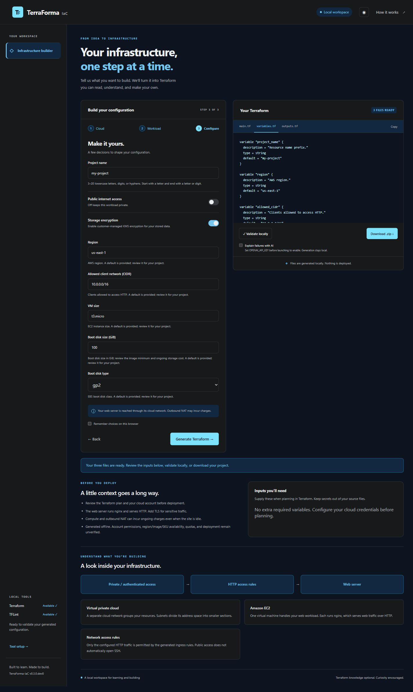
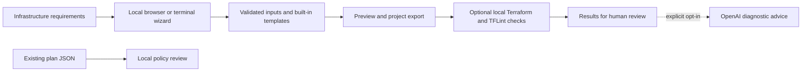

<div align="center">

# TerraForma-IaC

### Enter your infrastructure requirements. Generate readable Terraform.

A local web interface and terminal wizard for AWS, Microsoft Azure and Google Cloud.
Choose a supported workload, enter its configuration inputs, and review the generated files.
You can start without Terraform experience or a cloud account.

[](https://www.python.org/) [](https://github.com/chriswayneh/TerraForma-IaC/actions/workflows/ci.yml) [](LICENSE) [](https://github.com/chriswayneh/TerraForma-IaC/releases/tag/v0.3.0)

[Start here](#quick-start) · [Screenshots](#screenshots) · [Security overview](docs/SECURITY_OVERVIEW.md) · [Architecture](#architecture) · [Roadmap](docs/ROADMAP.md)

</div>

## What you can do

Terraform describes infrastructure in text files. TerraForma builds those files from a guided questionnaire and explains the resources they describe.

| Step | What happens |
| --- | --- |
| **Configure** | Choose a cloud and workload, then enter the supported variables. |
| **Understand** | Preview the Terraform and read the resource explanations. |
| **Check** | Optionally run local Terraform/TFLint checks or review an existing plan JSON file. |
| **Export** | Download a project you can review, save in Git and reuse. |

**TerraForma does not deploy or delete cloud resources, run a Terraform plan, or approve a deployment.** Generated projects still need cloud-specific review before use. Local checks do not prove that a configuration will deploy successfully.

## Quick start

You need **Git and Python 3.11 or newer**. Terraform, TFLint, cloud credentials and an AI key are optional for this first run. Installation downloads Python dependencies.

These commands install **released v0.3.0** in its own Python environment. Run the block for your operating system in a terminal.

### Windows — PowerShell

```powershell
git clone --branch v0.3.0 --depth 1 https://github.com/chriswayneh/TerraForma-IaC.git
cd TerraForma-IaC
python -m venv .venv
.venv/Scripts/python.exe -m pip install ".[web]"
.venv/Scripts/python.exe -m terraforma.cli serve --open-browser
```

### macOS / Linux

```bash
git clone --branch v0.3.0 --depth 1 https://github.com/chriswayneh/TerraForma-IaC.git
cd TerraForma-IaC
python3 -m venv .venv
.venv/bin/python -m pip install ".[web]"
.venv/bin/python -m terraforma.cli serve --open-browser
```

Open [http://127.0.0.1:8765](http://127.0.0.1:8765) if a browser does not open. Keep the terminal running; **Ctrl+C** stops the server. The app runs on your computer. No Node.js or frontend build is required.

**First project:** choose **AWS → A static website**, use `first-site` as the project name, leave public access off, and enter the demonstration AWS account ID `123456789012`. Keep the other defaults, then select **Generate Terraform** and **Download .zip**. This is an offline private object-storage example; it does not publish a website or contact AWS during generation. The account ID is a synthetic placeholder: replace it with your intended account and review the project before live use.

You are done with the first run when you can open the downloaded `main.tf`, `variables.tf` and `outputs.tf`. Follow [Getting started](docs/GETTING_STARTED.md) for file explanations, optional checks, terminal commands and troubleshooting. A [release wheel](https://github.com/chriswayneh/TerraForma-IaC/releases/tag/v0.3.0) is also available; the package is not published on PyPI.

## Screenshots

The local workspace combines configuration inputs with a Terraform preview. These screenshots show the interface; feature availability follows the installed version.



More detailed VM questions are available on the development branch:


## Supported starting configurations

The table describes the **v0.3.0 release**, with recipes for all three providers. These are documented starting patterns, not coverage of every service, VM size or cloud option.

| Workload | AWS | Azure | Google Cloud |
| --- | --- | --- | --- |
| Linux or Windows VM | EC2 | Azure VM | Compute Engine |
| Single web server | EC2 with nginx | Ubuntu VM with nginx | Debian VM with nginx |
| Load-balanced tier | EC2 and Application Load Balancer | VM scale set and load balancer | Managed instance group and load balancer |
| Managed PostgreSQL | RDS | Flexible Server | Cloud SQL |
| Static site / object storage | S3 | Blob Storage | Cloud Storage |

Public/private choices and encryption controls depend on the recipe. A private static-site recipe creates authenticated object storage. Database standby configurations are not sharded clusters. Web-server recipes need a separate TLS review before sensitive use. See [recipe inputs and limits](docs/PROJECT_SPECIFICATION.md).

## Security and adoption

Start with [the security overview](docs/SECURITY_OVERVIEW.md) for data flows, access boundaries, verification evidence and adoption prerequisites.

| Question | Current behavior |
| --- | --- |
| Does it need cloud access to generate files? | No. Account references are configuration inputs; authentication remains separate. |
| Does it collect cloud passwords or API keys in the browser? | No. Secret values belong in external credential/variable mechanisms. |
| Does anything leave the computer? | Generation is local. Native validation can download provider/linter plugins. Consented target checks contact cloud services. AI diagnostics send failed logs to OpenAI only when enabled. |
| Are native checks isolated from the host? | Temporary files are isolated; trusted Terraform/TFLint binaries and plugins still have host authority. |
| Does a passing check approve deployment? | No. Permissions, costs, connectivity, state protection and a reviewed plan remain separate responsibilities. |

Keep AI explanations off when diagnostic data must stay local. Redaction is best effort. Terraform state and plan exports can contain secrets and need protected storage. [Security policy and vulnerability reporting](SECURITY.md) · [Validation details](docs/VALIDATION.md)

## Architecture

Both interfaces use the same input contracts and generation core.



[Architecture and trust boundaries](docs/ARCHITECTURE.md) · [Generated project files](docs/ARTIFACTS.md) · [Dependency trust](docs/DEPENDENCIES.md)

## Versions and phases

| Track | Status | What to expect |
| --- | --- | --- |
| **v0.3.0** | Released | Guided generation, reusable projects, local checks and review. Use this for the first run above. |
| **v0.4.0** | In development on `main` | Expanded Linux/Windows VM inputs. Live creation, login, initialization and cleanup testing remain pending dedicated cloud accounts. |
| **v1.0.0** | Planned | A stable local and hosted workspace, with protected state and approved user-controlled provisioning runners. |

The `main` branch contains unreleased features. [The roadmap](docs/ROADMAP.md) lists versions, phases and release gates. [Verification](docs/VERIFICATION.md) distinguishes offline tests, native checks and live evidence; **v0.4.0 is not released**.

## Find the next guide

| I need to… | Open |
| --- | --- |
| Install, create a first project or fix a startup problem | [Getting started](docs/GETTING_STARTED.md) |
| Assess the local tool before organizational use | [Security overview](docs/SECURITY_OVERVIEW.md) |
| Understand cloud authentication | [Cloud authentication](docs/CLOUD_AUTHENTICATION.md) |
| Validate files or use the GitHub Action (trusted code only) | [Validation guide](docs/VALIDATION.md#github-action) |
| Review a plan or prepare state storage inputs | [Plan review](docs/PLAN_REVIEW.md) · [State protection](docs/STATE_PROTECTION.md) |
| Explore development VM inputs and Terragrunt export | [Documentation index](docs/README.md) |
| Contribute code or report a problem | [Contributing](CONTRIBUTING.md) · [Security reporting](SECURITY.md) |

[Release notes](docs/RELEASE_0.3.0.md) · [Changelog](CHANGELOG.md) · [MIT license](LICENSE)
