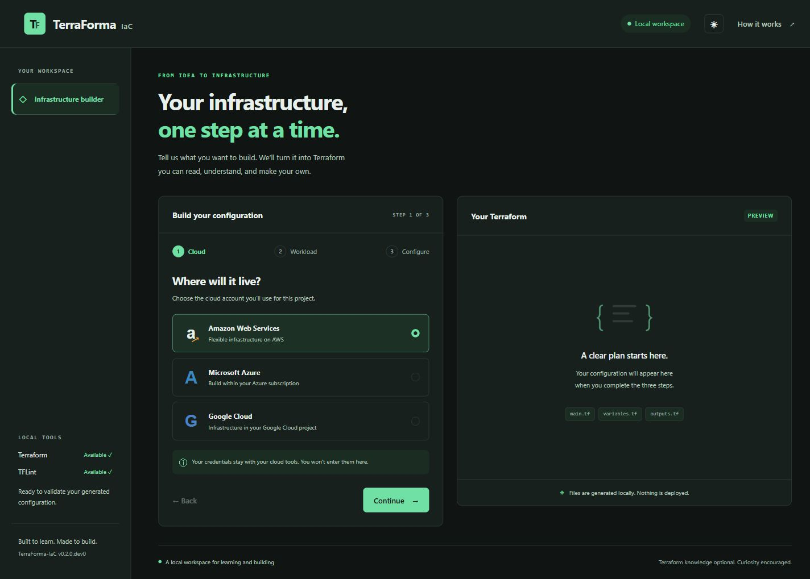

<div align="center">

# TerraForma-IaC

### Generate. Understand. Validate.

A lightweight local workspace for creating Terraform through a guided questionnaire, reading the generated configuration, and checking it before deployment.

[](https://www.python.org/)
[](https://github.com/chriswayneh/TerraForma-IaC/actions/workflows/ci.yml)
[](LICENSE)
[](docs/ROADMAP.md)

**Development version:** `0.2.0.dev0`. The local visual workspace is being verified before the first release.

[Quick Start](#install-and-use) · [Getting Started](docs/GETTING_STARTED.md) · [Workloads](#generated-infrastructure) · [Architecture](docs/ARCHITECTURE.md) · [Roadmap](docs/ROADMAP.md) · [Contributing](CONTRIBUTING.md)

</div>

---



## What you get

- A three-step browser wizard with a dark theme and an optional light theme.
- AWS, Azure, and Google Cloud configurations with public/private access choices.
- Readable previews of `main.tf`, `variables.tf`, and `outputs.tf`.
- A simplified access diagram and plain-language resource explanations.
- ZIP downloads with project-specific input guidance.
- Local Terraform and TFLint checks, with optional AI explanations of failures.
- A CLI and reusable GitHub Action over the same backend.

Generation works without cloud credentials, an OpenAI key, Terraform, or TFLint. Install the native tools when you want to validate. The app never applies infrastructure.

## Install and use

Requires Python 3.11+, Terraform 1.6+ and TFLint on PATH. Install Terraform and TFLint separately using their official installers.

```powershell
git clone https://github.com/chriswayneh/TerraForma-IaC.git
cd TerraForma-IaC
python -m venv .venv
.venv/Scripts/python.exe -m pip install -e ".[web]"
.venv/Scripts/terraforma.exe serve
```

Open [the local workspace](http://127.0.0.1:8765) in your browser. Stop the server with Ctrl+C. Use `--port` to choose another port or `--open-browser` to launch your default browser. On macOS/Linux, use `.venv/bin/python` and `.venv/bin/terraforma` instead of the Windows paths.

For the terminal workflow, install the base package and use:

```powershell
terraforma wizard
terraforma run --dir ./my-project --no-ai
```

Activate your virtual environment first, or use its full executable path. The web server binds to this computer's loopback address; it is not intended for network exposure or multi-user hosting.

The wizard creates `main.tf`, `variables.tf`, and `outputs.tf` in a new project directory. Use `--dir` to choose the destination. It refuses to add generated files to an existing Terraform configuration. Cancellation writes nothing.

To enable optional AI explanations, set `OPENAI_API_KEY` in your environment before launching. The UI requires an explicit opt-in to send redacted failed command logs to OpenAI. The CLI uses AI on failures when a key is available; use `--no-ai` for entirely local diagnosis. The default model is `gpt-4o` through OpenAI Chat Completions. Validation works without a key. Known-secret redaction cannot identify every possible secret. Neither interface separately uploads source files, but tool diagnostics may include snippets.

## Generated infrastructure

| Workload | AWS | Azure | Google Cloud |
| --- | --- | --- | --- |
| Single web server | EC2, nginx, VPC | Ubuntu VM, nginx, VNet | Debian VM, nginx, VPC |
| Load-balanced tier | Two EC2 instances, ALB | Two-instance VM scale set, load balancer | Two-instance managed group, HTTP or internal TCP load balancer |
| Managed PostgreSQL | Multi-AZ RDS | Flexible Server with same-zone HA | Regional Cloud SQL |
| Static site | S3 | Blob Storage | Cloud Storage |

All workloads support public or private access. Private static sites are authenticated object storage, not a publicly hosted website. Database templates use backups and deletion protection. They create a managed primary and standby, not a sharded database cluster. Public databases require a restricted client IP/CIDR; set the generated variable to your actual client network.

Required inputs are declared without defaults in `variables.tf`: Azure subscription ID, Azure compute SSH public key, Google Cloud project ID, database passwords, and selected database firewall inputs. Supply them using Terraform variables, preferably environment variables for secrets. Configure cloud authentication separately using your provider's normal credential chain. Required values are unnecessary for structural validation but are needed for planning and deployment.

Azure and Google Cloud encrypt stored data by default. S3 also enforces server-side encryption. The encryption option enables customer-managed KMS encryption for AWS compute/databases and encryption at host for Azure compute; Azure subscription and VM-size support are required. It never disables mandatory provider encryption. Google Cloud uses provider-managed keys in this release.

These are starting configurations, not deployment certification. Web servers and most load balancers serve HTTP; add TLS before sensitive use. NAT gateways, load balancers, managed databases, storage, and VMs can incur charges. The AWS NAT gateway is shared across availability zones and the Azure/GCP compute tiers do not guarantee availability across zones. Review quotas, organization policy, region/SKU availability, access, and a Terraform plan before deploying. Sensitive Terraform variables can still appear in state; secure your state storage.

## Validation behavior

`terraforma run` discovers absolute tool paths, copies the target directory into a temporary workspace, runs `terraform init -backend=false -input=false`, `terraform validate -json`, `tflint --init`, and recursive TFLint checks, then removes the copy. It captures both output streams, stops dependent checks when initialization fails, and applies a per-command timeout (`--timeout`, default 120 seconds). Any failed or unavailable check exits with status 1, including when AI explanations fail. It never runs plan, apply, or destroy.

Local child modules and referenced assets must reside inside the selected target directory. Include a shared parent directory as the target only if it is itself a Terraform root. External/sibling paths, linked files, and directory junctions are unsupported. The copy excludes Terraform state, `.terraform`, `.git`, virtual environments, `.env` files and variable-value files. Limits are 8 MiB per file and 32 MiB per copied workspace. Existing `.terraform.lock.hcl` and `.tflint.hcl` files are preserved. Provider locks generated inside a validation copy are discarded; initialize the reviewed real configuration yourself and commit its lockfile to pin provider selections.

This is filesystem isolation, not a security boundary. Terraform/providers, modules, and configured TFLint plugins execute on the host and may access its credentials and network. Validate trusted configurations only. The built-in TFLint Terraform rules run by default; cloud-specific rules require an explicit plugin configuration. TFsec is not implemented. The web UI validates regenerated, reviewed templates; arbitrary HCL editing and host-directory import are not exposed through its API.

## GitHub Action

```yaml
steps:
  - uses: actions/checkout@v4
  - uses: chriswayneh/TerraForma-IaC@main
    with:
      target_dir: infrastructure
      openai_api_key: ${{ secrets.OPENAI_API_KEY }}
```

The `main` reference is for development; pin a reviewed commit for reproducibility. Tagged Action releases will follow the release roadmap. The action installs Python, Terraform, TFLint, and this package from its own action directory. The API key is optional. Avoid running validation with credentials on untrusted pull requests.

## Development

```powershell
python -m pip install -e ".[dev]"
python -m pytest -q
python -m ruff check src tests
```

Automated tests cover questionnaire cancellation, overwrite protection, all generator combinations, isolated validation/error handling, local API protections, ZIP downloads, and HTTP diagnostics contracts with mocked OpenAI responses. Native provider validation is an additional check and requires tools and network access. Enable it with `TERRAFORMA_NATIVE_TESTS=1`. No cloud infrastructure is provisioned by tests. Live OpenAI requests and cloud deployment behavior remain unverified; see the [roadmap](docs/ROADMAP.md).
