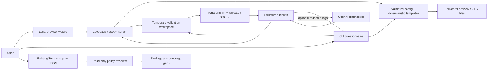

# Architecture

[Getting started](GETTING_STARTED.md) · [Screenshots](../README.md#screenshots) · [Roadmap](ROADMAP.md) · [Verification](VERIFICATION.md)

TerraForma-IaC is a Python package with two interfaces over one generation and validation core. The local web UI uses plain browser assets served by FastAPI; it requires no Node.js installation or frontend build.

## Boundaries

- `generator.py` validates questionnaire inputs and renders reviewed HCL blocks. User strings are escaped as literal HCL; internal expressions are represented separately.
- `sandbox.py` owns temporary workspaces, tool discovery, command execution, results, and cleanup. It never applies or destroys infrastructure.
- `ai_engine.py` owns redaction, asynchronous HTTP requests, retries, and strict diagnostic parsing. Suggestions do not edit files.
- `cli.py` exposes generation, validation, local plan review, and local serving commands.
- `plan_review.py` inspects bounded plan JSON exports and produces reports without raw resource values. Its initial rules have limited coverage and never grant apply approval.
- `request_limits.py` bounds mutation request bodies to 64 KiB before route parsing.
- `web.py` exposes generation, validation, and ZIP download routes. It accepts questionnaire state, not arbitrary HCL or arbitrary host paths. Slow native checks run off the event loop, with one validation at a time.
- `static/` contains the buildless browser application. It keeps the current questionnaire in browser memory, optionally saves non-secret choices locally, and displays server-returned text using text nodes.

## Local API protection

The supported launcher binds to `127.0.0.1`. Requests have trusted-host checks, mutation routes require a process-specific session token, and cross-origin mutation requests are rejected. The UI loads no remote scripts or fonts. No cloud credentials or API keys are collected through the UI.

This protects the local browser workflow; it is not authentication for a shared deployment. Do not expose the app to a network or run it as a multi-user service without redesigning access controls and execution isolation.

## Validation limits

Validation initializes providers and checks configuration structure and configured lint rules. It does not verify cloud account quotas, organization policies, pricing, successful resource creation, or application reachability. Native binaries and plugins execute on the host; temporary files do not contain an untrusted process.

Cloud credentials are needed for planning/deployment, not questionnaire generation. Required variables are declared in the generated `variables.tf`. Some values can remain unknown during structural validation. Cloud runtime verification is a later roadmap phase.

## Testing

Unit and API tests cover generation, local request boundaries, ZIP contents, validation integration, cancellation, overwrite refusal, timeouts, and malformed AI responses. Optional native tests check all provider/workload/access/encryption combinations against installed provider schemas and TFLint. Browser walkthroughs cover the visible workflow. Package checks verify that installed wheels contain the web assets.
