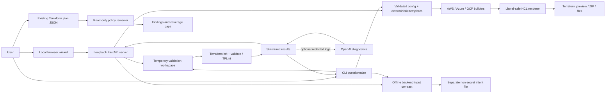

# Architecture

[Getting started](GETTING_STARTED.md) · [Screenshots](../README.md#screenshots) · [Roadmap](ROADMAP.md) · [Verification](VERIFICATION.md)

TerraForma-IaC is a Python package with two interfaces over one generation and validation core. The local web UI uses plain browser assets served by FastAPI; it requires no Node.js installation or frontend build.

## Boundaries

- `configuration.py` defines the strict recipe selection model and supported image/username constants. `generator.py` retains its public imports for existing callers.
- `generator.py` declares common input contracts, coordinates provider builders and protects output paths. Its existing facade remains available to the CLI, API and integrations.
- `providers/aws.py`, `providers/azure.py` and `providers/gcp.py` emit provider-specific compute, database and static-site blocks using the shared builder context. They do not execute cloud operations.
- `hcl.py` renders HCL blocks and escapes user strings as literals; internal expressions remain separate typed values. All provider builders use this same renderer.
- `project.py` validates versioned specifications and derives shared input contracts. Browser and terminal questionnaires use these contracts; manifest imports use bounded strict JSON parsing.
- `catalog.py` describes recipe scope, fixed choices, unsupported features, and outstanding account checks.
- `backend.py` defines strict non-secret S3/Azure Blob/GCS intent models and shared questionnaire validation. Terminal and browser workflows save/download a separate input file; they never initialize a backend or access state. API review reports omit references; downloads intentionally contain validated non-secret references.
- `preflight.py` performs optional bounded cloud CLI reads after explicit consent. VM metadata requires a matching target and separate consent; reported architecture and SKU restrictions do not establish capacity, quotas, image compatibility or deployment approval.
- `artifacts.py` creates deterministic unsigned generation receipts and checksum lists. Its local comparison command reads only declared artifact filenames with size limits and reports byte mismatches without file contents or deployment approval.
- `sandbox.py` owns temporary workspaces, tool discovery, command execution, results, and cleanup. It never applies or destroys infrastructure.
- `ai_engine.py` owns redaction, asynchronous HTTP requests, retries, and strict diagnostic parsing. Each attempt has a wall-clock timeout (30 seconds by default, configurable up to 120), collects at most 64 KiB of decoded response data, closes streams on exit and refuses redirects. Retry delays are finite and capped at 10 seconds, with at most five attempts (three by default). Error response bodies are not collected. Suggestions do not edit files. Streaming uses the [HTTPX asynchronous API](https://www.python-httpx.org/async/).
- `cli.py` exposes generation, validation, local plan review, and local serving commands.
- `plan_review.py` inspects bounded plan JSON exports and produces reports without raw resource values. Its initial rules have limited coverage and never grant apply approval.
- `json_input.py` shares strict UTF-8, duplicate-key, finite-number and nesting checks across local imports, tool metadata and AI diagnostics. Local files accept a UTF-8 BOM; API JSON bodies do not.
- `request_limits.py` bounds mutation bodies to 64 KiB before route parsing, with an explicit 8 MiB exception for the plan-review route. JSON requests require UTF-8, unique object keys, finite numbers and at most 64 nesting levels; rejected input values are omitted from errors. Non-JSON content remains subject to route-specific parsing.
- `web.py` exposes generation, validation, ZIP download, project import, and local plan-review routes. It accepts validated specifications or plan JSON, not arbitrary HCL or arbitrary host paths. Native checks and plan review run off the event loop, with one validation and one review at a time.
- `static/` contains the buildless browser application. It keeps the current questionnaire in browser memory, optionally saves non-secret choices locally, and displays server-returned text using text nodes.

## Local API protection

The supported launcher binds to `127.0.0.1`. Requests have trusted-host checks, mutation routes require a process-specific session token, and cross-origin mutation requests are rejected. The UI loads no remote scripts or fonts. No cloud credentials or API keys are collected through the UI.

This protects the local browser workflow; it is not authentication for a shared deployment. Do not expose the app to a network or run it as a multi-user service without redesigning access controls and execution isolation.

## Validation limits

Validation initializes providers and checks configuration structure and configured lint rules. It does not verify cloud account quotas, organization policies, pricing, successful resource creation, or application reachability. Native binaries and plugins execute on the host; temporary files do not contain an untrusted process.

The bounded command runner manages a Windows job or a POSIX session/process group and cleans up associated helpers when the parent finishes or fails. It retains bounded output and the parent's exit status. Windows job attachment happens immediately after launch, leaving a launch/attachment gap; POSIX descendants can detach. This is trusted-tool cleanup rather than containment. See [Windows job semantics](https://learn.microsoft.com/en-us/windows/win32/procthread/job-objects) and [Python process session options](https://docs.python.org/3/library/subprocess.html).

Validation removes `TF_VAR_*` values, `OPENAI_API_KEY`, injected Terraform CLI arguments, and selected tool/log overrides from child-process environments. This matches the exclusion of variable-value files: structural checks use the generated defaults and unresolved required variables, rather than externally supplied secrets. Other host settings and credential sources can remain available, including files in the user profile; this filtering is not credential containment or a process sandbox.

Cloud credentials are needed for planning/deployment, not questionnaire generation. Required variables are declared in the generated `variables.tf`. Some values can remain unknown during structural validation. Cloud runtime verification is a later roadmap phase.

## Testing

Unit and API tests cover generation, local request boundaries, ZIP contents, validation integration, cancellation, overwrite refusal, timeouts, and malformed AI responses. Optional native tests check all provider/workload/access/encryption combinations against installed provider schemas and TFLint. Browser walkthroughs cover the visible workflow. Package checks verify that installed wheels contain the web assets.
