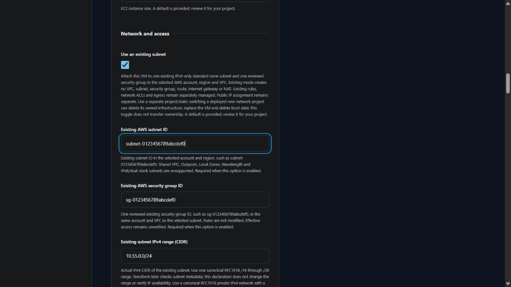

# Use an existing AWS subnet

v0.4.0 development supports standalone Linux and Windows VMs in one existing **IPv4-only** standard-zone subnet with one reviewed security group. Both must belong to the selected AWS account and the same VPC, in the selected region. New-network mode remains the default. The latest release remains v0.3.0; live attachment, login and cleanup remain unverified.

Under **Network and access**, select **Use an existing subnet** and enter the following references and review declaration.

| Input | What to enter |
| --- | --- |
| Existing AWS subnet ID | `subnet-` followed by the existing 8- or 17-character hexadecimal ID |
| Existing AWS security group ID | One reviewed `sg-` ID in the same account and VPC as the subnet |
| Existing subnet IPv4 range | Actual canonical RFC1918 CIDR, with a /16 through /28 prefix |
| Private IPv4 address | Optional usable address in that subnet; leave blank for cloud allocation. The first four and last addresses are reserved. |
| AWS availability zone | Leave blank to inherit the existing subnet's zone, or enter its matching standard zone name |
| Network review | Review effective security-group rules, network ACLs, administrator access, routing, egress, account, region and zone |

Generation rejects missing references, omitted existing CIDRs, conflicting new-network ranges, absent review and unusable private addresses. Terraform later reads subnet and security-group metadata and checks account ownership, matching VPC, declared CIDR, IPv4-only/non-Outposts status and standard-zone compatibility. The provider's account restriction and selected region also apply. These checks do not inspect effective rules, network ACLs, available addresses, attachment permissions or connectivity. Generation makes no cloud request.

## Ownership and access

| Item | New-network mode | Existing-subnet mode |
| --- | --- | --- |
| VPC and subnets | Created by this project in two standard zones | Existing subnet referenced through a data lookup; not managed |
| Security group | Created with the recipe's administrator rule | One existing group attached; rules not modified |
| Route tables, associations and internet gateway | Created by this project | Not created or configured |
| NAT gateway and outbound address | Created for a private VM | Not created or configured |
| VM public address | Controlled by Public internet access | Controlled by the same separate choice; reachability still requires compatible existing routing |
| New VM, disks and key pair | Managed by this project | Managed by this project |

The administrator CIDR does not update existing rules. Review access, routing, outbound connectivity and Windows activation independently. A public IP alone does not make a subnet reachable from the internet. A private VM requires an independently configured administrator path. This mode creates no VPN, bastion, IAM grant or connection. Plan review cannot establish the safety of rules and network ACLs outside the generated plan.

Use a separate project/state when attaching to independently managed infrastructure. **Switching an already deployed new-network project to existing mode can delete its old VPC, subnets, rules, routes, gateways and NAT, replace its VM and delete boot data.** The toggle does not transfer ownership or preserve previously managed infrastructure. Review the exact plan and recovery requirements before any separately authorized operation.

Generated `moved` blocks map four previous uncounted network addresses in public mode, or seven in private mode, to counted addresses. Subnets and route associations already used counted addresses. These moves address Terraform naming changes only and do not preserve resources whose count is changed to zero. Live upgrades and state recovery remain unverified.

Shared/cross-account VPCs, Outposts, Local Zones, Wavelength, IPv6/dual-stack subnets, multiple security-group selection and changes to existing rules are unsupported. Broader network composition remains on the roadmap.

Metadata checks follow the official [subnet data source](https://registry.terraform.io/providers/hashicorp/aws/latest/docs/data-sources/subnet), [security-group data source](https://registry.terraform.io/providers/hashicorp/aws/latest/docs/data-sources/security_group) and [EC2 instance resource](https://registry.terraform.io/providers/hashicorp/aws/latest/docs/resources/instance). See the [VM input inventory](VM_INPUTS.md) and [roadmap](ROADMAP.md) for remaining choices and acceptance gates.
