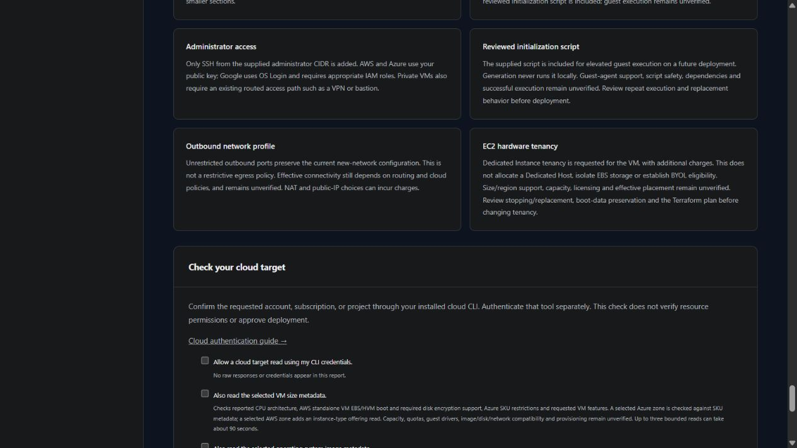

# AWS VM hardware tenancy

Available on development main for standalone AWS Linux and Windows VMs. The latest release remains v0.3.0; live tenancy, creation and access are unverified.

In **Image and capacity**, select **EC2 hardware tenancy**. The terminal wizard asks the same question. The choice is preserved in saved projects, generated variable defaults, summaries and the resource guide.

| Choice | Generated behavior | Review before deployment |
| --- | --- | --- |
| Provider/VPC default | Leaves instance tenancy unmanaged (`null`) | Effective placement depends on provider/VPC behavior. An existing dedicated-tenancy VPC can enforce dedicated placement |
| Dedicated Instance | Requests `dedicated` tenancy on the standalone VM | Supported size/region, capacity, licensing and additional regional/instance charges |

Dedicated Instances use account-dedicated compute hardware, which can also serve other instances in the same account. EBS storage is not dedicated. This choice neither allocates a Dedicated Host nor establishes BYOL eligibility or host affinity. See [AWS Dedicated Instance guidance](https://docs.aws.amazon.com/AWSEC2/latest/UserGuide/dedicated-instance.html) and [launching dedicated instances in a default-tenancy VPC](https://docs.aws.amazon.com/AWSEC2/latest/UserGuide/dedicatedinstancesintovpc.html).

Existing-subnet mode still manages only the new VM and its supported resources; this choice does not change existing VPC tenancy. Host allocation, host IDs, host resource groups and other tenancy values are unsupported. Other providers and web-tier recipes do not offer this input.

Tenancy changes can require stopping or replacing a VM. Review the Terraform plan, boot-disk/key preservation, access interruption and recovery before changing a deployed configuration. Returning to Provider/VPC default stops managing the setting and does not reset an existing VM's effective tenancy. No cloud operation is performed by generation.

The optional cloud metadata preflight does not check tenancy support or effective placement. A successful size/image check does not establish dedicated capacity or licensing compatibility.

## Verification

Local checks cover Linux/Windows, new/existing networks and both tenancy choices. Provider-mocked plan tests verify the declared dedicated value without executing apply. Structural checks verify that the generator requests no host ID, host resource group or Dedicated Host resource. Native validation and lint do not establish live compatibility, cost, isolation or deployment readiness. Dedicated-account creation, access, tenancy changes and cleanup remain pending [VM acceptance testing](VM_ACCEPTANCE.md).
