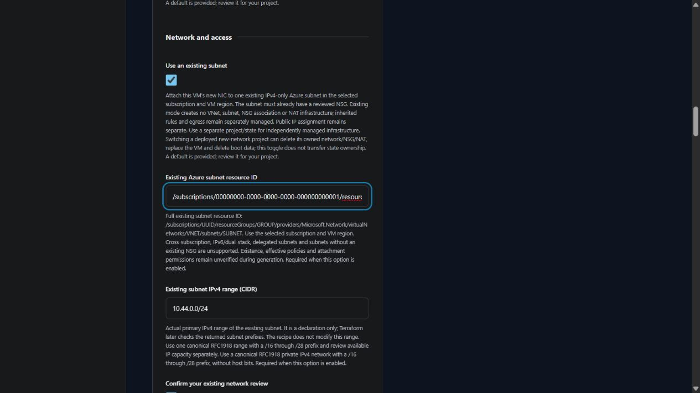

# Use an existing Azure subnet

v0.4.0 development supports standalone Linux and Windows VMs in one existing **IPv4-only** subnet in the selected Azure subscription and VM region. The subnet must already have a reviewed network security group (NSG). New-network mode remains the default. The latest release remains v0.3.0; live attachment, login and cleanup remain unverified.

Under **Network and access**, select **Use an existing subnet** and enter its reference and actual range. Record your network review before generating.

| Input | What to enter |
| --- | --- |
| Existing Azure subnet resource ID | `/subscriptions/UUID/resourceGroups/GROUP/providers/Microsoft.Network/virtualNetworks/VNET/subnets/SUBNET` in the selected subscription |
| Existing subnet IPv4 range | Actual canonical RFC1918 CIDR, with a /16 through /28 prefix |
| Private IPv4 address | Optional usable address in that subnet; leave blank for cloud allocation. The first four and last addresses are reserved. |
| Network review | Review the subscription, region, CIDR, NSG, effective rules, non-delegated status, administrator path, routing and outbound connectivity |

Generation rejects missing references, cross-subscription references, missing review, omitted existing CIDRs, conflicting new-network ranges and unusable private addresses. The new-network CIDR question is hidden in existing mode. Terraform later reads the VNet and subnet metadata and requires the selected region, one matching IPv4 prefix and a subnet NSG. These checks do not inspect delegation, effective NSG policies, available addresses, permissions or connectivity. Generation makes no cloud request.

## Ownership and access

| Item | New-network mode | Existing-subnet mode |
| --- | --- | --- |
| VNet and subnet | Created by this project | Referenced through data lookups; not managed |
| Administrator NSG and subnet association | Created with the recipe's administrator rule | Existing subnet NSG required; no rule or association created |
| NAT gateway and outbound public IP | Created by this project | Not created or configured |
| New VM, NIC and resource group | Created by this project | Created by this project; NIC attaches to the existing subnet |
| VM public address | Controlled by Public internet access | Controlled by the same separate choice |

The administrator CIDR remains a declaration and does not update existing rules. Review effective access and outbound connectivity independently, including Windows activation. A private VM requires a separately managed routed access path. This mode creates no VPN, bastion, IAM/RBAC grant or connection. Plan review does not establish the safety of policies outside the generated plan.

Use a separate project/state when attaching to independently managed infrastructure. **Switching an already deployed new-network project to existing mode can delete its old VNet, subnet, NSG and NAT, replace its VM and delete boot data.** The toggle does not transfer ownership or preserve previously managed infrastructure. Review the exact plan and recovery requirements before any separately authorized operation.

Generated `moved` blocks map eight previous standalone network resource addresses to their new counted addresses in new-network mode. They address Terraform naming changes only and do not preserve resources whose count is changed to zero. Live upgrades and state recovery remain unverified.

Cross-subscription, IPv6/dual-stack, delegated and NSG-free subnets are unsupported. Broader network composition remains on the roadmap.

Provider metadata and attachment fields follow the official [subnet data source](https://registry.terraform.io/providers/hashicorp/azurerm/latest/docs/data-sources/subnet), [VNet data source](https://registry.terraform.io/providers/hashicorp/azurerm/latest/docs/data-sources/virtual_network) and [network interface resource](https://registry.terraform.io/providers/hashicorp/azurerm/latest/docs/resources/network_interface). See the [VM input inventory](VM_INPUTS.md) and [roadmap](ROADMAP.md) for remaining choices and acceptance gates.
