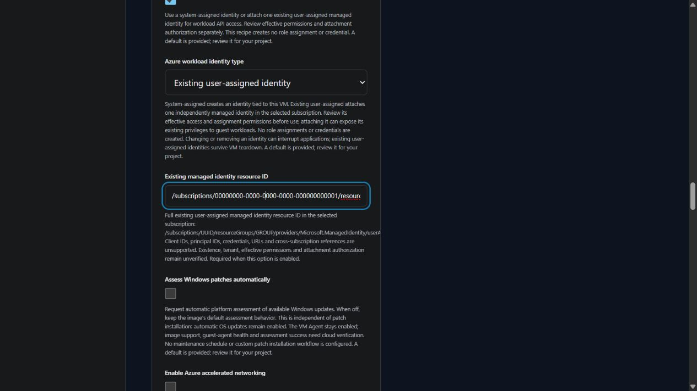

# Azure VM workload identity

v0.4.0 development supports one existing user-assigned managed identity for standalone Linux and Windows VMs. The existing system-assigned option remains the default when workload identity is enabled. Workload identity is disabled by default; the latest release remains v0.3.0.

Under **Operations and identity**, enable workload identity and choose the identity type.

| Choice | Inputs | Lifecycle |
| --- | --- | --- |
| Disabled | No identity reference | No VM identity block is generated at runtime |
| System-assigned | No existing resource ID | Azure creates an identity tied to the VM; its principal ID is exported. VM deletion removes it. |
| Existing user-assigned | One complete managed identity resource ID in the selected subscription | The VM attaches an independently managed identity. VM deletion does not remove that identity. |

The existing reference must use `/subscriptions/UUID/resourceGroups/GROUP/providers/Microsoft.ManagedIdentity/userAssignedIdentities/NAME`. Client IDs, principal IDs, credentials, arbitrary URLs and cross-subscription attachment are unsupported. Missing references, inactive references and conflicting modes fail closed in project compilation and generated Terraform preconditions. The browser and terminal use the same input contract.

Attaching an existing identity can give guest workloads access through its existing permissions. Review its owner, tenant, effective RBAC roles, resource scope, application requirements and assignment authorization before using the files. Removing or changing identity can interrupt applications. Generation does not query Azure, create a user-assigned identity, create role assignments or read credentials. Live attachment, token access, effective privileges and cleanup remain unverified.

The `managed_identity_principal_id` output is populated only for system-assigned mode. The `user_assigned_identity_resource_id` output records the declared existing resource ID in user-assigned mode; it does not claim a verified principal or successful attachment. Simultaneous system/user-assigned mode and multiple existing identities are outside this implementation.

The supported identity block fields are documented in the official [Azure Linux VM](https://registry.terraform.io/providers/hashicorp/azurerm/latest/docs/resources/linux_virtual_machine) and [Azure Windows VM](https://registry.terraform.io/providers/hashicorp/azurerm/latest/docs/resources/windows_virtual_machine) provider references. Review the generated Terraform plan and [state protection requirements](STATE_PROTECTION.md) before any separately authorized deployment.
