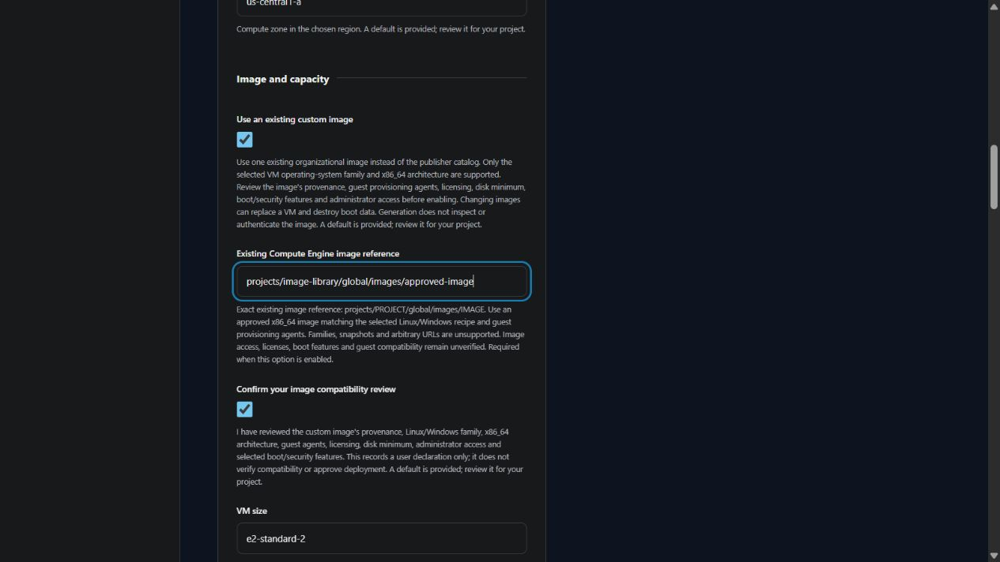
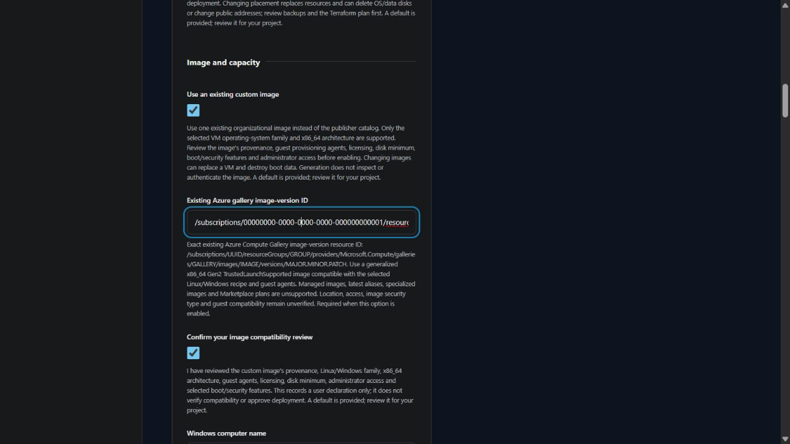

# Existing VM images

Available in **v0.4.0 development** for standalone Linux and Windows VMs. The latest released version remains v0.3.0. Generation and local validation do not establish image trust, boot success, access or deployment readiness.

Select **Use an existing custom image** under **Image and capacity**. Enter the image reference and record your compatibility review. Catalog operating-system and version questions are hidden while this option is enabled. The terminal wizard asks the same questions.

| Cloud | Required image input | Additional input | Supported scope |
| --- | --- | --- | --- |
| AWS | Exact private AMI ID, such as `ami-0123456789abcdef0` | Owner's 12-digit AWS account ID; existing SSH administrator username for Linux | EBS-backed HVM x86_64 image matching the selected Linux/Windows family, without product codes |
| Azure | `/subscriptions/UUID/resourceGroups/GROUP/providers/Microsoft.Compute/galleries/GALLERY/images/IMAGE/versions/MAJOR.MINOR.PATCH` | Existing Linux administrator/public key or external Windows password, as required by the VM recipe | Generalized x86_64 Gen2 TrustedLaunchSupported gallery image compatible with the selected guest |
| GCP | `projects/PROJECT/global/images/IMAGE` | Administrator connection path and separate OS Login or Windows guest authentication | Existing x86_64 Compute Engine image matching the selected Linux/Windows family and guest agents |

Azure uses an exact Compute Gallery image version while retaining the VM's boot protection settings.

## Before generating

Review the image's owner and provenance, OS family, guest provisioning agents, architecture, minimum boot-disk size, licensing, signed boot components and administrator access. The confirmation records your declaration; TerraForma does not inspect the image. Increase the boot disk if the image requires it. Keep credentials and private keys outside the project.

For an AWS Linux custom image, supply the existing non-root SSH administrator account. This affects connection guidance only: it does not create an account or configure the guest. Verify that the image imports the supplied launch public key into that account. Windows custom AMIs must support the recipe's separate EC2 password recovery workflow. Azure gallery images must be generalized, Gen2, x86_64, TrustedLaunchSupported and support provisioning through the selected guest agent. Exact version components must each be between 0 and 2147483647, without leading zeros. GCP images must support the configured OS Login or Windows authentication workflow.

Changing an image can replace a VM and delete boot data. Review the Terraform plan, backups, retained disks and encryption-key lifecycle before using regenerated files. No application installation, filesystem setup, IAM grant or cloud operation is performed by this questionnaire.

## Generated configuration

| Cloud | Selection behavior | Remaining checks |
| --- | --- | --- |
| AWS | Disables the publisher lookup in custom mode. Looks up the exact AMI with the declared owner, private visibility, x86_64, HVM and EBS filters. Planning postconditions reject a mismatched platform or product codes. | Regional existence, launch permissions, image provenance, guest boot, administrator access, licensing and workload behavior |
| Azure | Uses `source_image_id` for a custom image and omits the catalog `source_image_reference` block. | Image OS/generalization/generation, region, image access, Trusted Launch compatibility, guest provisioning and licensing |
| GCP | Uses the exact existing image reference as the boot-disk source. | Image access, OS and architecture, agents, licensing, boot settings and guest authentication |

Shared Terraform preconditions require the declaration and an exact reference in custom mode. Inactive custom-image values and conflicting catalog selections are rejected during project compilation. Generated HCL also guards against these conflicting inputs. Import preserves accepted references and regenerates files using the installed generator; old template labels do not select an older implementation.

Azure managed images, unversioned/latest gallery references, specialized images and Marketplace plans; GCP image families and snapshots; AWS public or product-code images; ARM64 images; and custom images for web tiers are outside this implementation. Input acceptance does not authorize provisioning.

The provider behavior is documented in the official [AWS AMI data source](https://registry.terraform.io/providers/hashicorp/aws/latest/docs/data-sources/ami), [Azure Linux VM](https://registry.terraform.io/providers/hashicorp/azurerm/latest/docs/resources/linux_virtual_machine), [Azure Windows VM](https://registry.terraform.io/providers/hashicorp/azurerm/latest/docs/resources/windows_virtual_machine) and [Google Compute Engine instance](https://registry.terraform.io/providers/hashicorp/google/latest/docs/resources/compute_instance) references.

Azure managed images are incompatible with the retained Trusted Launch configuration. The initial development managed-image reference format is now rejected; replace it with an approved exact Compute Gallery image version before regenerating. See Microsoft’s [Trusted Launch restrictions](https://learn.microsoft.com/en-us/azure/virtual-machines/trusted-launch), [gallery image guidance](https://learn.microsoft.com/en-us/azure/virtual-machines/trusted-launch-portal) and [image version format](https://learn.microsoft.com/en-us/azure/virtual-machines/image-version). Generation still does not inspect the image definition or verify the declared security type.
