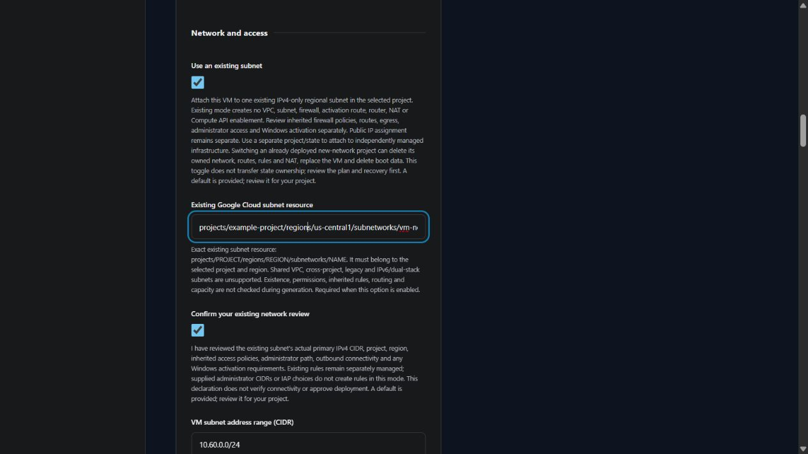

# Use an existing Google Cloud subnet

v0.4.0 development supports standalone Linux and Windows VMs in one existing **IPv4-only** regional subnet in the selected Google Cloud project. New-network mode remains the default. The latest release remains v0.3.0; live attachment, access and cleanup have not been verified.

Under **Network and access**, select **Use an existing subnet** and enter its reference and actual primary IPv4 range. Record your network review before generating.

| Input | What to enter |
| --- | --- |
| Existing subnet resource | `projects/PROJECT/regions/REGION/subnetworks/NAME` in the selected project and region |
| VM subnet address range | The existing subnet's actual primary, canonical RFC1918 IPv4 CIDR, with a /16 through /28 prefix |
| Private IPv4 address | Optional usable address in that declared subnet; leave blank for cloud allocation. The first two and last two addresses are reserved. |
| Network review | Confirm review of inherited rules, routing, egress, administrator access and any Windows activation requirements |

Generation rejects missing references, cross-project/region references, absent declarations, omitted existing CIDRs and addresses outside the declared usable range. Terraform later reads the referenced subnet and checks that its primary CIDR matches the declaration and its stack type is IPv4-only. Generation itself makes no cloud request and does not verify existence, permissions, capacity or connectivity.

## Ownership and access

| Item | New-network mode | Existing-subnet mode |
| --- | --- | --- |
| VPC and subnet | Created by this project | Referenced through a subnet data lookup; not managed |
| Administrator firewall | Generated for the selected direct network or IAP path | Existing rules remain separately managed; the supplied CIDR/path does not create a rule |
| Router and NAT | Created by this project | Not created or configured |
| Windows activation route/rule | Created for the Windows recipe | Existing network must provide activation connectivity |
| Compute API enablement | Managed with disable-on-destroy off | Must already be enabled; this project does not manage it |
| VM public address | Controlled by Public internet access | Controlled by the same separate choice |
| Network tags | Uses the recipe's tag for its new rules | No network tag is attached automatically |

Inherited firewall policies and routes can expose or block a VM regardless of the questionnaire's administrator CIDR. Review effective access, egress, guest authentication and existing IAP setup independently. This path grants no IAM access, creates no VPN/bastion and opens no connection. A private VM needs an existing routed administrator path or independently configured IAP access. The local plan reviewer does not establish the safety of infrastructure outside this project's plan.

Use a separate project/state when attaching to independently managed infrastructure. **Switching an already deployed new-network project to existing-subnet mode can delete its old owned network, rules, routes and NAT, replace the VM and delete boot data.** The toggle does not transfer state ownership or preserve previously managed infrastructure. Review the exact plan and recovery requirements before any separately authorized operation.

Generated `moved` blocks map prior standalone network resource addresses to their new counted addresses for regeneration in new-network mode. They address Terraform naming changes only. Live upgrades and state recovery remain unverified; they do not preserve resources whose count is deliberately changed to zero.

Shared VPC, cross-project attachment, legacy networks, IPv6/dual-stack subnets and automatic management of existing rules/NAT are outside this implementation. Broader network composition continues in the [roadmap](ROADMAP.md).

The official [Compute subnet data source](https://registry.terraform.io/providers/hashicorp/google/latest/docs/data-sources/compute_subnetwork) and [Compute Engine network interface](https://registry.terraform.io/providers/hashicorp/google/latest/docs/resources/compute_instance) references describe the lookup and attachment fields. Local ownership checks use [Terraform provider mocks](https://developer.hashicorp.com/terraform/language/tests/mocking); they do not prove cloud permissions or deployment success.
