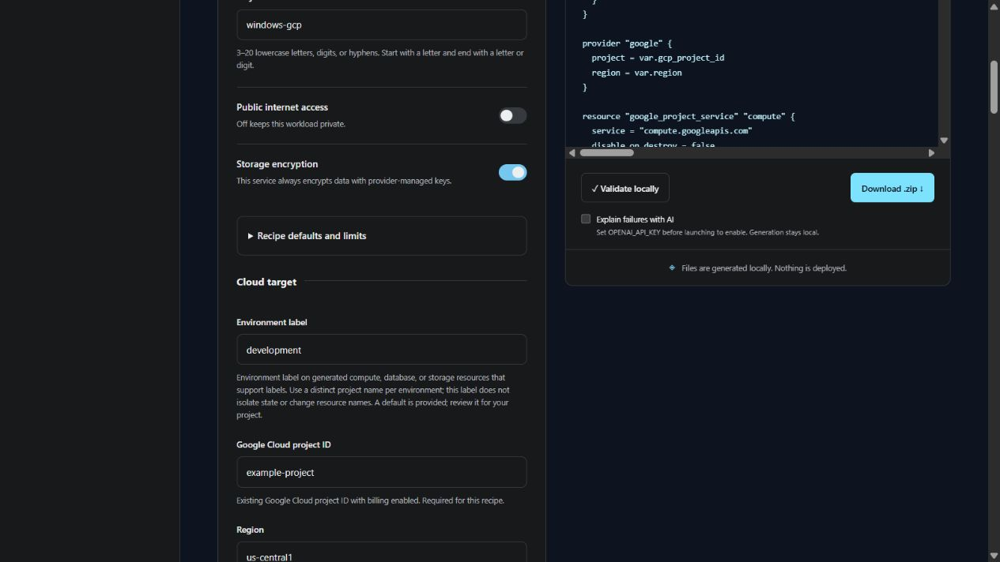

# Getting started

## 1. Launch the local workspace

Install Python 3.11+, then clone the repository and install the optional web interface into a virtual environment:

```powershell
git clone https://github.com/chriswayneh/TerraForma-IaC.git
cd TerraForma-IaC
python -m venv .venv
.venv/Scripts/python.exe -m pip install -e ".[web]"
.venv/Scripts/terraforma.exe serve
```

On macOS/Linux, replace `.venv/Scripts/` with `.venv/bin/`. Open `http://127.0.0.1:8765`. You do not need cloud credentials or an AI key to generate files.

## 2. Create a first configuration

Configuration inputs are grouped by cloud target, image/capacity, network/access, storage and operations/identity. Enter the supported variables in each section; conditional disk and identity questions appear when enabled. External secrets are shown as references rather than password fields.



For a small first example, select **Amazon Web Services → A static website**, name the project `first-site`, and leave public access off. Generate the files and inspect all three tabs.

- `main.tf` defines the provider and resources to create.
- `variables.tf` declares the inputs those resources use.
- `outputs.tf` defines the useful values Terraform will show after deployment.

The diagram and resource guide explain the major parts. This example stores an HTML object privately; it does not create a publicly reachable website. Generation itself creates no cloud resources and incurs no cloud usage charges.

Enable **Remember choices on this browser** to retain the questionnaire selections and current step locally. No credentials, API key, AI opt-in, generated code, or validation logs are saved with these choices. Uncheck it to remove the saved choices; the current form stays available. Storage access is optional, and the app remains usable when browser storage is disabled.

## 3. Set up optional local validation

You do not need accounts with all three clouds to work on or test TerraForma locally. A configuration for your own deployment needs the selected cloud's account/subscription/project reference; the local test suite uses example references without authenticating to those accounts.

Development builds include [six account-free VM examples](../examples/vm/README.md) for importing and reviewing Linux/Windows inputs across all three providers. These use synthetic references and demonstration keys, require `0.4.0.dev0` development support and must not be deployed as provided.

| Stage | Cloud account needed? |
| --- | --- |
| Generate example files and run local unit/provider validation | No cloud credentials; provider downloads need network access |
| Opt-in target and VM metadata checks | Credentials for the selected cloud only |
| Live deployment/access/cleanup testing | A dedicated account/project and permissions for each cloud being tested; these checks remain outstanding |

Install Terraform using [HashiCorp's official installation instructions](https://developer.hashicorp.com/terraform/install). Install TFLint using [the official TFLint installation guide](https://github.com/terraform-linters/tflint#installation). Choose the binary for your operating system and CPU architecture.

On Windows, extract the executables into a directory on your user PATH. On macOS/Linux, follow the official package-manager or binary instructions. Verify in a new terminal:

```text
terraform -version
tflint --version
```

After changing PATH, restart the TerraForma server so it inherits the updated environment. The sidebar shows whether both tools are available. The app does not install native tools automatically.

Choose **Validate locally** to initialize the provider and run structural checks in a temporary workspace. Provider installation needs network access and can take several minutes on the first run. A passing check means the configuration is structurally valid and passed the configured lint rules; it does not establish successful deployment, application reachability, costs, or cloud permissions.

## 4. Download and review

Choose **Download .zip**. Extract it into a project directory. The archive includes all three Terraform files and a README that describes required inputs and the generated resources.

Before planning, configure authentication using your cloud provider's normal credential chain. Use the [cloud authentication guide](CLOUD_AUTHENTICATION.md) to connect your selected tools and understand Terraform's separate credential requirements. Supply the required variables listed by the UI and `variables.tf`. Do not put passwords or API keys in the web form or commit them to Git.

Review a Terraform plan before applying anything. Cloud resources can incur costs after deployment; NAT gateways, load balancers, managed database standbys, storage, and VMs may charge while idle. Terraform can store sensitive values in state even if a variable is marked sensitive. Use appropriate state storage and access controls.

## 5. Optional AI explanations

Set `OPENAI_API_KEY` in the server's environment before launching. The browser never collects the key. Enable **Explain failures with AI** to send redacted failed command logs to OpenAI. Known-secret redaction is best effort, and logs may contain source snippets. Leave the option off for local-only checks.

Suggestions are shown for review and are not applied automatically. A suggested fix does not turn a failed validation into a passing result. CLI validation also defaults to local-only diagnostics; pass `--ai` explicitly to request an explanation.

## Local plan review

The CLI can inspect a Terraform plan JSON export using `terraforma review-plan --file review.tfplan.json`. It flags selected destructive, network, storage, and database concerns without applying resources or transmitting the plan. See [plan review](PLAN_REVIEW.md) for export instructions, limits, and why a successful command still requires manual review.

## Troubleshooting

| Symptom | Next step |
| --- | --- |
| A tool is shown as not installed | Verify its executable is on PATH in a new terminal, then restart the server. |
| Provider initialization fails | Check network/proxy settings, registry availability, and local disk space. |
| Another validation is running | Wait for the current validation to finish; one native check pipeline runs at a time. |
| The local request is rejected | Refresh the page to obtain a new session token after restarting the server. |
| Port 8765 is busy | Launch with `terraforma serve --port 8766`. |
| A required input is missing when planning | Read `variables.tf` and supply the named input using Terraform's variable mechanisms. |
| A private endpoint is unreachable from your laptop | Private resources require connectivity into their cloud network; authenticated storage objects require credentials. |

See the [architecture](ARCHITECTURE.md), [security guidance](../SECURITY.md), and [roadmap](ROADMAP.md) for the project's execution boundaries and planned features.
