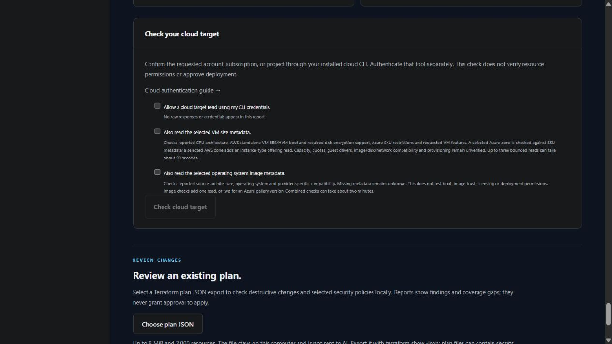
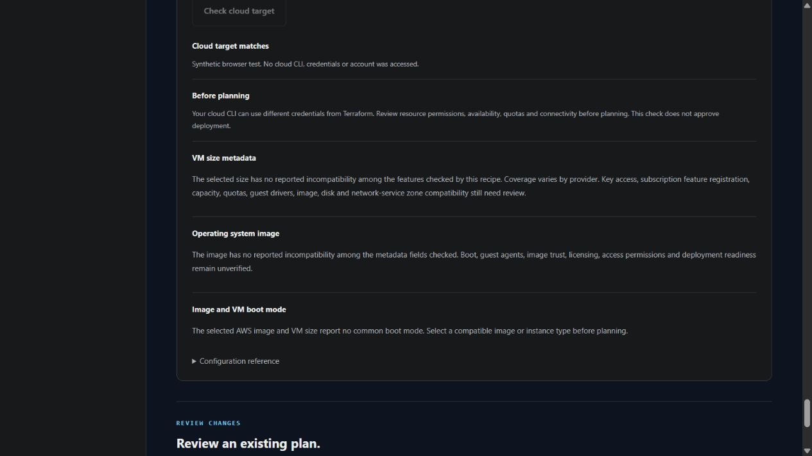

# Check the selected operating system image

This optional check is available on the development branch for Linux/Windows VMs and the supported web-server recipes. Generation remains offline. The check reads image metadata through an installed cloud CLI only after separate target and image consent.

```text
terraforma preflight --spec terraforma.project.json --verify-target --verify-image
```

Add `--verify-machine` to include the existing VM-size checks. In the browser, enable the target consent and **Also read the selected operating system image metadata**. Authentication stays in your cloud tool; TerraForma does not log in, create accounts or grant access.



## What is checked?

| Provider | Source selection | Reported compatibility fields |
| --- | --- | --- |
| AWS | Declared private AMI/owner, or the selected publisher catalog and exact pin/latest selection in the requested region | Available state, x86 architecture, Linux/Windows platform, EBS/HVM boot, root disk minimum, additional EBS image disks, declared deprecation and any returned image-policy restriction. Custom AMIs also require private visibility and no product codes. |
| Azure gallery | Exact selected image-version ID and its matching definition | Completed replication to the VM region, succeeded provisioning, x64 architecture, OS family, generalized Gen2 image, declared `TrustedLaunchSupported`, OS disk minimum, additional image disks and purchase-plan requirements. |
| Azure catalog | Selected publisher, offer, SKU and version in the requested subscription/location | Returned version identity, x64 architecture, OS family, Gen2, purchase-plan requirements, additional image disks and reported deprecation. Minimum boot disk size and Trusted Launch eligibility still need independent review. |
| GCP | Exact image reference or the selected publisher's image family/version | Returned project/image identity, ready state, x86 architecture, Windows guest feature versus Linux selection, minimum disk size and reported deprecation. |

An image with additional image data disks is outside the checked AWS/Azure recipe layout. A nonempty purchase plan on the checked Azure sources or product codes on a custom AWS image are unsupported. Scheduled AWS/Azure deprecation requires review even if its date is in the future; this check does not decide whether an exception is appropriate.

## Understand the result

| Result | Meaning |
| --- | --- |
| `metadata_confirmed` | Every field checked for this source has no reported incompatibility. This establishes neither successful boot nor deployment approval. |
| `metadata_unknown` | At least one checked field was unavailable. Missing architecture, replication, security type or disk minimum is never assumed compatible. Azure catalog responses do not establish a boot disk minimum, so their result remains unknown. |
| `incompatible` | At least one checked property conflicts with the recipe or its supported scope. Review the selected image and configuration before planning. |
| `selection_incomplete` | AWS returned another page. No latest selection is confirmed from that partial page; choose an exact pin or inspect the source separately. |
| `not_found`, `failed`, `invalid_response` | Selection was empty, a bounded read failed, or metadata was malformed/ambiguous. Raw diagnostics and metadata remain omitted. |
| `not_checked`, `not_applicable` | Image consent was absent, the target was not confirmed, or the workload does not support this check. |

CLI results exit unsuccessfully when a requested image check remains unknown, incompatible or failed. Reports contain compatibility flags and a SHA-256 reference digest, never raw identifiers, image descriptions, tags or provider responses. A digest identifies the returned reference; it does not attest to image content or provenance.

### AWS image and VM boot mode

Selecting both `--verify-image` and `--verify-machine` also compares the AMI's declared boot mode with the selected instance type's reported supported modes. This reuses those responses and adds no cloud command. The separate `image_machine_check` remains unchecked when either consent is absent and is not applicable to the other providers.

UEFI-only images need a size that reports UEFI; Legacy BIOS images need Legacy BIOS support. A UEFI-preferred image can use either reported mode. When it falls back to Legacy BIOS, the browser flags that UEFI-dependent features still require review. For a confirmed x86 image with no optional AMI boot-mode parameter, the comparison uses AWS's documented Intel/AMD Legacy BIOS default. Missing/empty VM boot-mode lists remain unknown; malformed enums and duplicate modes are rejected.

The combined CLI check exits unsuccessfully for an incompatible or unknown image/VM boot-mode comparison, even if the separate size and image metadata checks succeeded. Firmware metadata does not establish guest configuration, drivers, NitroTPM prerequisites, Secure Boot behavior or successful boot.



This screenshot was generated by an isolated local mock server. No cloud target or metadata was accessed.

## Read limits and remaining checks

Target confirmation always comes first. A mismatch or unavailable target prevents image reads. AWS/GCP/catalog Azure add one image command; a gallery version adds two. Combined target, size, selected AWS zone offering and image checks use at most four commands. Each command has a 30-second default timeout and a 128 KiB limit per output stream. The default combined budget is therefore up to about two minutes; CLI `--timeout` applies separately to each command and accepts at most 120 seconds.

AWS listing is limited to one page and preserves its continuation indicator. Azure's second gallery reference is derived from the user's validated version ID, never followed from a response URL. Malformed/duplicate JSON, duplicate selected root mappings, replication regions and security-type fields are rejected. A failed gallery version read stops before its definition read.

The checks trust the installed CLI, its configured endpoints and existing credentials. Authentication can refresh local credential caches. Its identity may differ from Terraform's credentials. Results cannot establish launch permissions, image sharing access at deployment time, key permissions, licensing entitlement, malicious image content, guest agents/drivers, Secure Boot behavior, actual boot, quotas, capacity, disk/network placement or initialization success. Optional source fields can be omitted by a CLI/API; an absent optional purchase plan or deprecation record means none was reported, not an independent assurance.

`latest` can change between this read and a Terraform plan. Review the actual resolved image and plan separately; this report neither pins the exported project nor creates resources. Dedicated-account creation, login, execution and cleanup evidence remains pending under [VM acceptance](VM_ACCEPTANCE.md). All development verification for this feature used synthetic mocked responses; no cloud image was read.

## Provider references

- [AWS image metadata and pagination](https://docs.aws.amazon.com/cli/latest/reference/ec2/describe-images.html)
- [AWS instance-type boot modes](https://docs.aws.amazon.com/AWSEC2/latest/UserGuide/instance-type-boot-mode.html), [AMI boot-mode defaults](https://docs.aws.amazon.com/AWSEC2/latest/UserGuide/ami-boot-mode.html) and [UEFI-preferred fallback](https://docs.aws.amazon.com/AWSEC2/latest/UserGuide/ami-boot.html)
- [Azure catalog image fields](https://learn.microsoft.com/en-us/rest/api/compute/virtual-machine-images/get?view=rest-compute-2025-04-01)
- [Azure gallery version CLI](https://learn.microsoft.com/en-us/cli/azure/sig/image-version?view=azure-cli-latest) and [gallery definition CLI](https://learn.microsoft.com/en-us/cli/azure/sig/image-definition?view=azure-cli-latest)
- [GCP image metadata](https://docs.cloud.google.com/compute/docs/reference/rest/v1/images) and [family selection CLI](https://docs.cloud.google.com/sdk/gcloud/reference/compute/images/describe-from-family)
