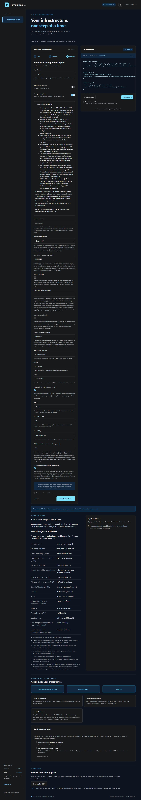

# Linux virtual machines

Available on `main` during development. The v0.2.0 release does not include the standalone VM recipe. Cloud creation, login, and teardown remain unverified.

Choose **A Linux virtual machine** in the browser or terminal wizard. This generates one VM in a new cloud network, with a selected supported Linux image, VM size, boot disk, and restricted SSH access. Application startup is left for your workload setup. Every configurable field is collected through the shared input contract.

## Questions and defaults

| Decision | What you provide | What stays fixed |
| --- | --- | --- |
| Target | AWS account ID, Azure subscription UUID, or Google Cloud project ID; environment label | Credentials use the cloud provider's normal credential chain; identity remains unverified offline |
| Placement | Region/location, plus zone for GCP | New network address ranges; existing-network attachment is not supported |
| Operating system | Supported provider-specific Linux choice | x86_64/AMD64 only; latest matching publisher image at planning time |
| Capacity and storage | VM size, boot-disk size/type, supported encryption choice | One VM; no data disks, autoscaling, custom images, or custom initialization |
| Network access | Public/private address choice and administrator CIDR | SSH port 22; no web ingress; private access needs an existing routed path |
| Authentication | AWS/Azure: an existing Ed25519 or RSA public key; Azure: administrator username (default `terraforma`); GCP: OS Login IAM prerequisites | No private key is generated or collected; password authentication stays disabled |

Public mode requires an explicit single IPv4 `/32` client address or RFC1918 private subnet. Private mode defaults to `10.0.0.0/16`; review it against your actual routed client network. Broader public administrator ranges, including `0.0.0.0/0`, are rejected in both forms and generated Terraform. Firewall permission alone does not provide routing or prove successful login.

## Provider access

| Provider | Generated authentication | Outputs and prerequisites |
| --- | --- | --- |
| AWS | Imports the supplied public key as an EC2 key pair; attaches it to the VM; requires IMDSv2 | `vm_address` and `ssh_username`: `ec2-user` for Amazon Linux, `ubuntu` for Ubuntu. Keep the matching private key locally and verify the image's actual access behavior. |
| Azure | Public-key login for the selected administrator username (default `terraforma`), with password authentication disabled; SSH allow rule followed by a deny rule for other inbound traffic | `vm_address` and `ssh_username`. Subscription/SKU support for optional host encryption still needs review. |
| GCP | Enables OS Login and blocks project metadata SSH keys; no instance SSH public key is collected | `vm_address`. Establish the required OS Login IAM access and organization-policy prerequisites before connecting. This recipe does not create IAM role assignments. |

Private VMs need connectivity into the generated network, such as a reviewed VPN, peering, or bastion route. Those resources are not created here. Compute, disks, outbound NAT, and public addresses can incur charges. Public/private selection controls addressing, not an assurance of end-to-end reachability.

The generated output has no application startup script or HTTP endpoint. Review the exported project guide, [supported image choices](PROJECT_SPECIFICATION.md#linux-image-selection), artifact receipt, cloud policy, and a Terraform plan before provisioning through your own workflow. TerraForma currently generates and validates; it does not execute apply or destroy.

Reference behavior: [EC2 key pairs](https://docs.aws.amazon.com/AWSEC2/latest/UserGuide/ec2-key-pairs.html), [Google SSH connections](https://docs.cloud.google.com/compute/docs/instances/ssh), and [project SSH-key restrictions](https://docs.cloud.google.com/compute/docs/connect/restrict-ssh-keys?hl=en).
