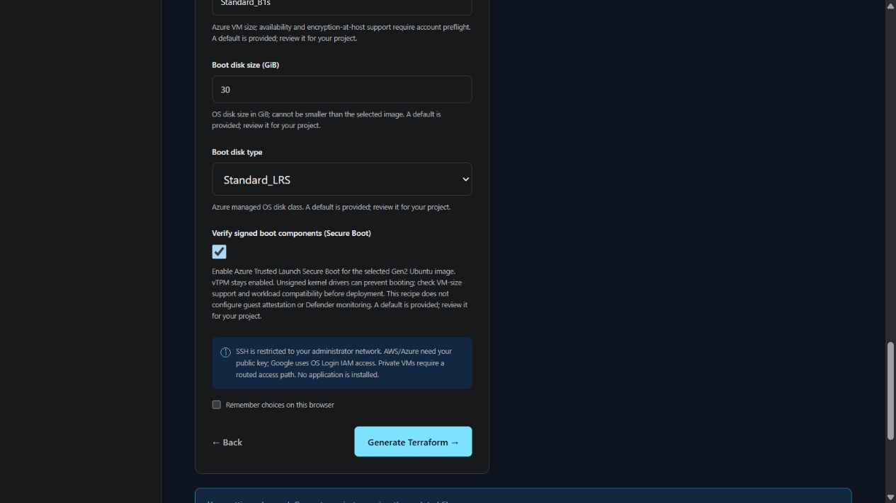
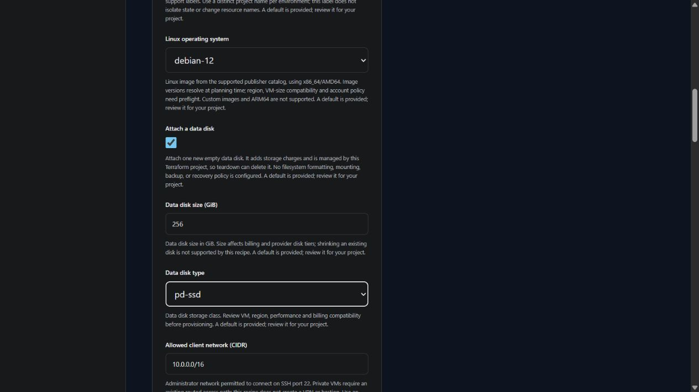
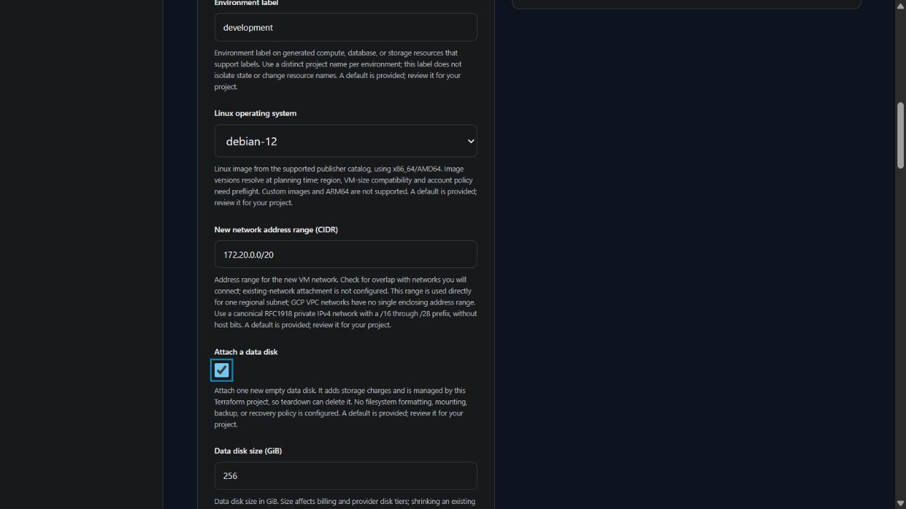
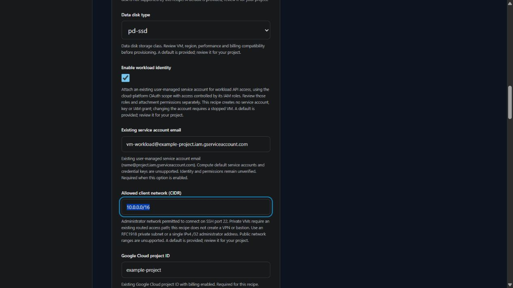
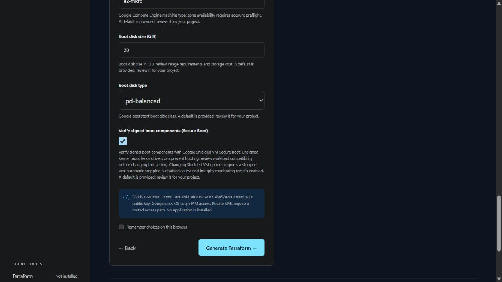

# Linux virtual machines

GCP standalone VMs offer a direct administrator network or [Google IAP tunnel](GCP_IAP_ACCESS.md). IAP generation targets SSH port 22; tunnel IAM and OS Login authentication are configured separately. Live connectivity remains unverified.

Azure standalone VMs expose `boot_disk_caching` and conditional `data_disk_caching`: None, ReadOnly or ReadWrite. Defaults remain ReadWrite for the OS and None for data. [Azure documents cache and I/O behavior](https://learn.microsoft.com/en-us/azure/virtual-machines/disks-performance). Review guest/application durability and safe cache changes; generation does not flush writes, verify performance or protect data through backups.

Available on `main` during development. The v0.2.0 release does not include the standalone VM recipe. Cloud creation, login, and teardown remain unverified.

Choose **A Linux virtual machine** in the browser or terminal wizard. This generates one VM in a new cloud network, with a selected supported Linux image, VM size, boot disk, and restricted SSH access. Application startup is left for your workload setup. Every configurable field is collected through the shared input contract.

## Questions and defaults

After provisioning with your reviewed Terraform workflow, `terraform output vm_id`, `vm_name` and `vm_location` provide references for follow-up cloud operations. AWS `vm_name` is a non-unique Name tag; use the instance ID. Azure also exports `vm_resource_group`; GCP operations need the project ID alongside the instance name and zone. These outputs contain no credentials and do not authorize an operation. Generation shows output definitions only; TerraForma does not provision resources or retrieve live identifiers.

GCP compute templates explicitly set `serial-port-enable = FALSE` to override project-level interactive serial access. The serial console has a separate access path that does not use ordinary VM IP allowlists; see [Google's console guidance](https://docs.cloud.google.com/compute/docs/troubleshooting/troubleshooting-using-serial-console). Read-only serial output, IAM permissions and organization policy remain separate concerns. Interactive serial access is not configurable in these recipes.

Azure standalone VMs include Secure Boot, enabled by default with vTPM retained. Changing Secure Boot replaces the VM and can delete its OS disk; review the Terraform plan and backups first. Confirm Trusted Launch support for the selected image and size, and review unsigned driver requirements. Guest attestation and Defender monitoring are not configured.

Azure standalone VMs also offer **Enable Azure accelerated networking**, off by default. The option changes the network interface's acceleration setting, while firewall access stays the same. The existing opt-in VM-size check reports Azure's advertised support when the option is enabled; missing or incompatible metadata requires review. It does not verify guest drivers or available capacity. Changes to an existing VM may require stopping and deallocating it. Review [Microsoft's requirements](https://learn.microsoft.com/en-us/azure/virtual-network/accelerated-networking-overview) before enabling the setting.

| Decision | What you provide | What stays fixed |
| --- | --- | --- |
| Target | AWS account ID, Azure subscription UUID, or Google Cloud project ID; environment label | Credentials use the cloud provider's normal credential chain; identity remains unverified offline |
| Placement | Region/location; optional AWS standard zone, Azure regional/zone 1–3, or GCP zone; new private network address range | Subnet layout is derived by the recipe; existing-network attachment is not supported |
| Operating system | Supported provider-specific Linux choice; Azure version may be `latest` or an exact `Major.Minor.Build` | x86_64/AMD64 only; AWS accepts a matching AMI ID; GCP accepts a matching exact published name; latest remains available |
| Capacity and storage | VM size, boot-disk size/type, supported encryption choice | One VM; no autoscaling, custom images, or custom initialization |
| AWS gp3 performance | Boot/data disk IOPS and throughput, shown for enabled gp3 disks | Defaults to included 3,000 IOPS/125 MiB/s; this template supports up to 16,000 IOPS/1,000 MiB/s and validates size/performance ratios |
| Data storage | Enable one data disk, size from 32–2048 GiB, supported disk class | Disabled by default; one new empty disk, no formatting/mounting, backup, or recovery policy |
| Monitoring | AWS: enable or disable detailed EC2 monitoring; disabled by default | No monitoring agent, log collection, or alarms; Azure/GCP monitoring options remain planned |
| Deletion protection | AWS/GCP: protect the standalone VM from specified deletion paths; enabled by default | No backup, whole-project protection, or Azure VM deletion lock is configured |
| Workload identity | AWS instance profile, Azure system-assigned identity, or GCP user-managed service account | Disabled by default; no IAM/RBAC grants or credential keys are created |
| Network access | Public/private address choice and administrator CIDR | SSH port 22; no web ingress; private access needs an existing routed path |
| Private address | Optional fixed IPv4 address, or automatic cloud allocation | Must be usable in the generated VM subnet; availability and independent address reservation are not checked |
| Azure NIC performance | Optional accelerated networking, off by default | Requires supported VM size and guest drivers; changing an existing VM can require stopping and deallocating it |
| Authentication | AWS/Azure: an existing Ed25519 or RSA public key; Azure: administrator username (default `terraforma`); GCP: OS Login IAM prerequisites | No private key is generated or collected; password authentication stays disabled |

Public mode requires an explicit single IPv4 `/32` client address or RFC1918 private subnet. Private mode defaults to `10.0.0.0/16`; review it against your actual routed client network. Broader public administrator ranges, including `0.0.0.0/0`, are rejected in both forms and generated Terraform. Firewall permission alone does not provide routing or prove successful login.

## Provider access

AWS/GCP standalone VMs ask **Protect this VM from accidental deletion**. AWS maps this to EC2 API termination protection; GCP maps it to VM deletion protection. Before intentionally deleting or replacing a protected VM, disable this choice and apply that configuration change through your Terraform workflow. Protection does not cover every deletion path, connected resource, or data-loss scenario. See [AWS termination protection](https://docs.aws.amazon.com/AWSEC2/latest/UserGuide/Using_ChangingDisableAPITermination.html) and [GCP provider deletion-protection requirements](https://registry.terraform.io/providers/hashicorp/google/latest/docs/resources/compute_instance).

For AWS VMs and web tiers, **Enable detailed EC2 monitoring** changes most EC2 metrics from five-minute to one-minute periods. Status checks already use one-minute periods. Detailed monitoring can add CloudWatch charges for each instance, including every VM in a tier; it does not provide guest memory metrics, application logs, or alarms. Review [AWS monitoring behavior](https://docs.aws.amazon.com/AWSEC2/latest/UserGuide/manage-detailed-monitoring.html) and [CloudWatch pricing](https://aws.amazon.com/cloudwatch/pricing/) before enabling it.

| Provider | Generated authentication | Outputs and prerequisites |
| --- | --- | --- |
| AWS | Imports the supplied public key as an EC2 key pair; attaches it to the VM; requires IMDSv2 | `vm_address` and `ssh_username`: `ec2-user` for Amazon Linux, `ubuntu` for Ubuntu. Keep the matching private key locally and verify the image's actual access behavior. |
| Azure | Public-key login for the selected administrator username (default `terraforma`), with password authentication disabled; SSH allow rule followed by a deny rule for other inbound traffic | `vm_address` and `ssh_username`. Subscription/SKU support for optional host encryption still needs review. |
| GCP | Enables OS Login and blocks project metadata SSH keys; no instance SSH public key is collected | `vm_address`. Establish the required OS Login IAM access and organization-policy prerequisites before connecting. This recipe does not create IAM role assignments. |

Private VMs need connectivity into the generated network, such as a reviewed VPN, peering, or bastion route. Those resources are not created here. Compute, disks, outbound NAT, and public addresses can incur charges. Public/private selection controls addressing, not an assurance of end-to-end reachability.

The generated output has no application startup script or HTTP endpoint. Review the exported project guide, [supported image choices](PROJECT_SPECIFICATION.md#linux-image-selection), artifact receipt, cloud policy, and a Terraform plan before provisioning through your own workflow. TerraForma currently generates and validates; it does not execute apply or destroy.

Reference behavior: [EC2 key pairs](https://docs.aws.amazon.com/AWSEC2/latest/UserGuide/ec2-key-pairs.html), [Google SSH connections](https://docs.cloud.google.com/compute/docs/instances/ssh), and [project SSH-key restrictions](https://docs.cloud.google.com/compute/docs/connect/restrict-ssh-keys?hl=en).

## Azure placement

Standalone Azure Linux and Windows VMs expose **Azure availability zone** in Cloud target. `regional` (default) requests no specific zone. Selecting `1`, `2` or `3` places the VM, optional managed data disk, Standard NAT gateway and generated public IPs in that zone. The network/subnet remains regional. This is one VM in one zone, not a redundant deployment or failover configuration.

The opt-in size metadata check compares a selected VM zone with Azure's reported SKU zone list. Missing metadata requires review and a zone absent from a reported list is incompatible. Existing SKU restrictions still prevent metadata confirmation. A listed VM zone does not establish capacity or disk/NAT/public-IP support; confirm those separately. Changing placement replaces resources and can delete OS/data disks or change public addresses; review backups and the Terraform plan before changing it. See the provider's [VM placement](https://registry.terraform.io/providers/hashicorp/azurerm/latest/docs/resources/linux_virtual_machine), [managed disk](https://registry.terraform.io/providers/hashicorp/azurerm/latest/docs/resources/managed_disk) and [Standard NAT gateway](https://registry.terraform.io/providers/hashicorp/azurerm/latest/docs/resources/nat_gateway) references.

## GCP host maintenance and restart

Standalone GCP Linux and Windows VMs expose **GCP host maintenance behavior** and **Restart the VM after host failures or maintenance** in Operations and identity. Defaults are `MIGRATE` and enabled automatic restart for a standard VM. `TERMINATE` stops the VM during host maintenance; automatic restart governs subsequent Compute Engine recovery, not deliberate user stops or application health.

Review machine-family support, downtime tolerance and the Terraform plan before changing these choices. These settings do not configure guest patch schedules, backups, application recovery or Spot/preemptible capacity. Automatic stopping for Terraform updates remains disabled. Live maintenance and restart behavior has not been tested. See [Google's host maintenance guidance](https://docs.cloud.google.com/compute/docs/instances/setting-vm-host-options).

## Optional data disk

Choose **Attach a data disk** to reveal size and storage-class questions. These questions are hidden when the option is off; inactive disk settings are omitted from browser exports and the configuration summary. The CLI asks size/type only when enabled. Existing manifests without these inputs continue with no data disk.

| Provider | Supported classes | Attachment and encryption |
| --- | --- | --- |
| AWS | `gp3` (default), `gp2` | One encrypted EBS volume in the VM's availability zone; uses the recipe KMS key when enabled, otherwise the account's default EBS encryption key. Requests `/dev/sdf`; Nitro Linux device names may differ. Forced detach is disabled, and attachment changes may stop the VM before detaching. |
| Azure | `StandardSSD_LRS` (default), `Standard_LRS`, `Premium_LRS` | One empty managed disk at LUN 0, with caching set to None. Azure storage encryption applies; the VM's optional host encryption still requires subscription support. |
| GCP | `pd-balanced` (default), `pd-standard`, `pd-ssd` | One zonal persistent disk attached as `data-disk`, with provider-managed encryption. No customer-managed disk key is configured. |

The `data_disk_id` output identifies the disk when enabled. Attachment alone does not provide a mounted filesystem: identify the actual device, then arrange filesystem setup, mounting, backups, and recovery through your reviewed workload workflow. The tool performs none of those guest operations. Disk class and size compatibility, quotas, permissions, and costs require account preflight.

This disk is managed by the exported Terraform project. Teardown can delete it, and VM deletion protection does not protect every disk or connected resource. Review data preservation before detaching, replacing, disabling, or removing it. Multiple disks, existing volumes/snapshots, custom IOPS/throughput, disk shrinking, and web-tier data disks remain unsupported.

Newly generated Azure optional data disks set `network_access_policy = "DenyAll"` and `public_network_access_enabled = false` to restrict remote import/export. They still attach as empty managed disks. This recipe has no disk export or private-endpoint workflow; it does not change OS disk export controls, create backups, prove guest encryption or protect state. Review [managed disk access controls](https://registry.terraform.io/providers/hashicorp/azurerm/latest/docs/resources/managed_disk) and a saved plan before changing an existing disk.

Provider references: [EBS volumes](https://registry.terraform.io/providers/hashicorp/aws/latest/docs/resources/ebs_volume), [Azure disk attachments](https://registry.terraform.io/providers/hashicorp/azurerm/latest/docs/resources/virtual_machine_data_disk_attachment), and [GCP persistent disks](https://registry.terraform.io/providers/hashicorp/google/latest/docs/resources/compute_disk).

## New network address range

Choose a private IPv4 range that does not overlap networks you intend to connect. TerraForma checks the input format and recipe bounds; it does not inspect existing networks or account connectivity. Only canonical RFC1918 ranges (`10/8`, `172.16/12`, `192.168/16`) are supported here. Host bits, IPv6, public ranges and carrier-grade NAT ranges are rejected.

| Provider | Recipe range | Generated subnets |
| --- | --- | --- |
| AWS | `/16` through `/20`, default `10.0.0.0/16` | Two public and two private subnets in two available zones. Eight prefix bits are added; subnet indices are 0, 1, 10 and 11. A `/16` yields `/24` subnets; a `/20` yields `/28` subnets. |
| Azure | `/16` through `/20`, default `10.0.0.0/16` | One workload subnet adds eight prefix bits at index 1. The default yields `10.0.1.0/24`. |
| GCP | `/16` through `/28`, default `10.0.1.0/24` | One regional subnet uses the selected range directly. The VPC itself has no enclosing CIDR. |

These are recipe bounds rather than the providers' complete capabilities. Individual subnet sizing, additional ranges, IPv6 and attachment to existing networks remain planned. Changing an exported project's range can replace network and dependent resources; review the Terraform plan and access/data preservation before applying changes. The administrator CIDR remains a separate access decision and is not automatically changed to match this range.

Provider references: [AWS VPC address ranges](https://docs.aws.amazon.com/vpc/latest/userguide/vpc-cidr-blocks.html), [Azure networking FAQ](https://learn.microsoft.com/en-us/azure/virtual-network/virtual-networks-faq), and [GCP subnets](https://docs.cloud.google.com/vpc/docs/subnets).

## Workload identity

Enable **Workload identity** when software running inside the VM needs authenticated cloud API access. This is separate from the credentials used to provision infrastructure and from the human administrator's SSH/OS Login access. The option is disabled by default.

| Provider | Questions and output | Permission and lifecycle checks |
| --- | --- | --- |
| AWS | Supply an existing IAM **instance profile name**, not a role name or ARN. The profile is attached to the VM. | Check the profile's account, EC2 trust relationship and role policies, plus the provisioner's `iam:PassRole` authorization. No profile, IAM role or policy grant is created. |
| Azure | Enable a **system-assigned managed identity**. The generated `managed_identity_principal_id` output identifies its principal when enabled. | No role assignments are granted. Arrange reviewed RBAC access separately. The identity is tied to this VM and is removed with it; recreating the VM creates a different principal. |
| GCP | Supply an existing **user-managed service account email**, such as `vm-workload@example-project.iam.gserviceaccount.com`. Its OAuth scope is `cloud-platform`; actual access is constrained by the service account's existing IAM roles. | Check attachment/act-as permissions and the service account's roles. No service account, key or IAM grant is created. Changing the attached account or scopes requires a stopped VM; the recipe does not allow automatic stopping for updates. |

AWS/GCP reference questions appear only when enabled. Missing references fail before export, and the generated Terraform includes a corresponding resource precondition. Turning the option off omits the reference from browser exports and the configuration summary. Explicitly supplied malformed references are rejected even when inactive.

Identity references are identifiers, not credentials. TerraForma validates their structure but cannot establish whether the referenced identity exists, belongs to the intended account, can be attached, or has appropriate permissions. Review least privilege, organization policy, metadata access and the Terraform plan before provisioning. Enabling an identity does not grant its workload access to any particular service. User-assigned Azure identities, Compute default service accounts, custom OAuth scopes, web-tier identities and IAM/RBAC policy creation remain outside this recipe.

Provider references: [EC2 roles and instance profiles](https://docs.aws.amazon.com/IAM/latest/UserGuide/id_roles_use_switch-role-ec2.html), [Azure managed identity lifecycle](https://learn.microsoft.com/en-us/entra/identity/managed-identities-azure-resources/overview), and [GCP service accounts and access scopes](https://docs.cloud.google.com/compute/docs/access/service-accounts).

## Google Shielded VM boot protection

For standalone GCP VMs, **Verify signed boot components (Secure Boot)** is enabled by default. The generated VM also explicitly enables vTPM and integrity monitoring. Turning Secure Boot off leaves those two protections enabled and appears in the exported choices summary.

Secure Boot can prevent unsigned kernel modules or drivers from loading. Review your workload before changing the setting. Shielded configuration changes require a stopped VM; the recipe keeps automatic stopping disabled, so arrange a maintenance window in your Terraform workflow. Integrity monitoring does not configure an alert destination or a recovery procedure.

The supported Debian 12 and Ubuntu 24.04 image families support Shielded VM according to Google's [operating system matrix](https://docs.cloud.google.com/compute/docs/images/os-details). Image versions resolve at planning time; account policy and workload compatibility remain unverified. See [Shielded VM behavior](https://docs.cloud.google.com/compute/shielded-vm/docs/shielded-vm) and the [Terraform resource settings](https://registry.terraform.io/providers/hashicorp/google/latest/docs/resources/compute_instance).

## AWS availability zone placement

Standalone Linux and Windows VMs accept an optional standard AWS availability zone name, such as `us-east-1b`. Leave it blank for the first available standard zone reported to the account. The selected name must match the entered region; names map differently between AWS accounts, and zone IDs, Local Zones and Wavelength Zones are unsupported. The VM and optional EBS disk use the first generated subnet zone. Public/private subnet pairs still require two standard zones; the selected zone comes first and another reported zone is used second.

Terraform checks reported membership and the two-zone requirement when planning. Offline generation does not check cloud availability. The optional VM-size preflight checks a selected zone's reported instance-type offering after required target and machine metadata checks pass. An offering does not establish capacity, quotas, deployment permissions, image compatibility or a second usable zone. Changing placement can replace subnets, the VM and disks, lose data and change addresses. Regenerating an older project can also change placement if enabled Local Zones previously appeared in its zone list. Review the plan, backups and recovery before deploying. See the [AWS provider zone lookup](https://github.com/hashicorp/terraform-provider-aws/blob/v6.0.0/website/docs/d/availability_zones.html.markdown).

## AWS CPU credit mode

Standalone AWS Linux and Windows VMs expose **CPU credit mode** in Operations and identity. Explicit modes support the template's x86 T2, T3 and T3a families; other families require `provider_default`.

| Choice | Meaning |
| --- | --- |
| `provider_default` | Omits the credit configuration block. Check the effective provider/account setting; the credit mode is unmanaged by this template. |
| `standard` | Uses earned CPU credits; sustained performance can fall when credits are depleted. |
| `unlimited` | Can use surplus credits above baseline performance; additional charges can apply. |

The questionnaire, saved specification and generated variable preserve the choice. Compilation and Terraform preconditions reject explicit modes for unsupported families. This option does not verify availability, OS support, performance or pricing.

Returning to `provider_default` stops managing the mode and **does not reset an existing VM**; review the resulting plan and effective setting. Switching from unlimited to standard can settle outstanding surplus-credit charges. Review [AWS's credit behavior](https://docs.aws.amazon.com/AWSEC2/latest/UserGuide/burstable-performance-instances-unlimited-mode-concepts.html) and the [provider's configuration/removal behavior](https://github.com/hashicorp/terraform-provider-aws/blob/v6.0.0/website/docs/r/instance.html.markdown#credit-specification).
