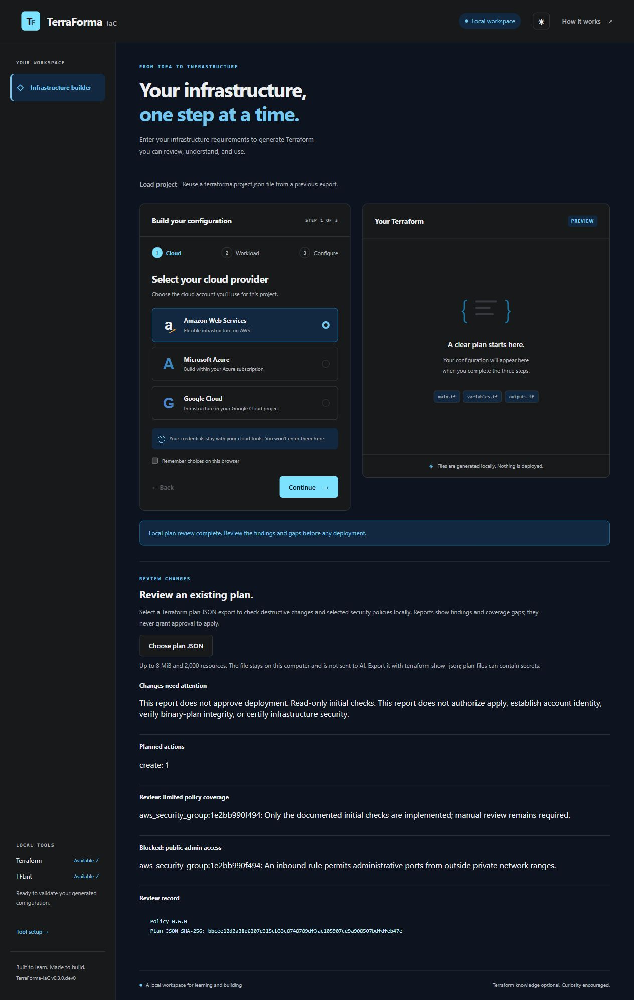

# Local plan review

The first security-foundation component reviews an existing Terraform plan JSON export locally. It does not create a plan, use cloud credentials, call AI, or run apply.

On `main` during v0.3 development, the browser also provides **Review an existing plan**. Select **Choose plan JSON**, open your export, and read action counts, blocking findings, review gaps, and the artifact digest. The file is sent only to the local server, processed in memory, and is not stored by this route or sent to AI. Invalid files return a generic error without plan values. One review runs at a time; the generator remains available when review finishes. This browser feature is not included in the v0.2.0 release.



For a trusted project that you have configured and authenticated separately:

```text
terraform plan -out=review.tfplan
terraform show -json review.tfplan > review.tfplan.json
terraforma review-plan --file review.tfplan.json
```

On Windows PowerShell 5.1, ensure the redirected JSON file is UTF-8 rather than UTF-16; PowerShell 7 uses UTF-8 for native output redirection. Use a terminal/version that preserves the Terraform JSON bytes. Keep both the binary plan and JSON export private: they can contain passwords, variables, and state values. The repository ignores `*.tfplan` and `*.tfplan.json`; choose these names or add an equivalent ignore rule for your own naming convention.

## Checks available now

- Deletes, replacements, and removal from state are blocked pending separate destructive review.
- Incomplete/failed plans and failed or unresolved Terraform checks are blocked.
- AWS security-group rules, standalone AWS ingress rules, Azure network security rules, and GCP firewall rules are checked for inbound SSH, RDP, and Windows remote-management ports from outside RFC1918/ULA private ranges.
- AWS EC2/EBS disks explicitly disabling encryption are blocked.
- AWS EC2 and GCP VM deletion protection disabled on a planned resource is flagged for review; changing an existing enabled control to disabled is blocked pending separate lifecycle review. Missing/unresolved controls remain review gaps. This does not establish protection for all deletion paths or connected disks.
- AWS volume attachments permitting forced detach are blocked because forced detach can damage filesystems or lose data. Missing/unresolved detach controls remain review gaps.
- AWS RDS storage explicitly disabling encryption, publicly accessible databases, and missing deletion protection are blocked.
- Unknown planned values and resources without specific rules are reported as review gaps.
- Malformed policy inputs fail closed when a supported rule cannot be evaluated.

These initial checks are intentionally limited. They do not account for the complete routing graph, every IAM condition, provider defaults, organization policy, TLS, or every resource attribute. Even recognized resource types have partial policy coverage. The report always states `approval_granted: false`; no report authorizes provisioning.

Development policy version `0.2.0` adds the VM and attachment lifecycle checks above. Azure VM locks, Azure/GCP disk-specific encryption policy, guest filesystem state, and backup/recovery policy remain outside these rules. Provider references: [EC2 termination protection](https://docs.aws.amazon.com/AWSEC2/latest/UserGuide/Using_ChangingDisableAPITermination.html), [GCP deletion protection](https://docs.cloud.google.com/compute/docs/instances/preventing-accidental-vm-deletion), and [EBS detach precautions](https://docs.aws.amazon.com/ebs/latest/userguide/ebs-detaching-volume.html).

## Results and automation

```text
terraforma review-plan --file review.tfplan.json --json-output
```

Exit `1` means blocking findings exist. Exit `0` means there are no findings classified as blocking by these initial checks; the status remains `manual_review_required`. A parse/read failure is a nonzero command error. Do not use exit `0` as an apply gate.

The report contains a policy version, SHA256 digest of the JSON bytes, action counts, and findings. It does not include raw before/after values or resource instance keys. Resources are identified using their type and a hash of the address, so keys containing private text do not appear in the report. The digest identifies this JSON export; it does not bind approval to a binary plan or verify account identity.

The reviewer accepts Terraform JSON format `1.x`, up to 8 MiB and 2,000 resource changes. Unknown major versions, duplicate JSON keys, non-finite numbers, state exports, and event-stream JSON are rejected. It reads files locally and makes no network request. Protect the original artifacts even though the report omits their values.

See the [roadmap](ROADMAP.md) for the future state, plan-integrity, and approval controls required before product-managed apply is supported.
