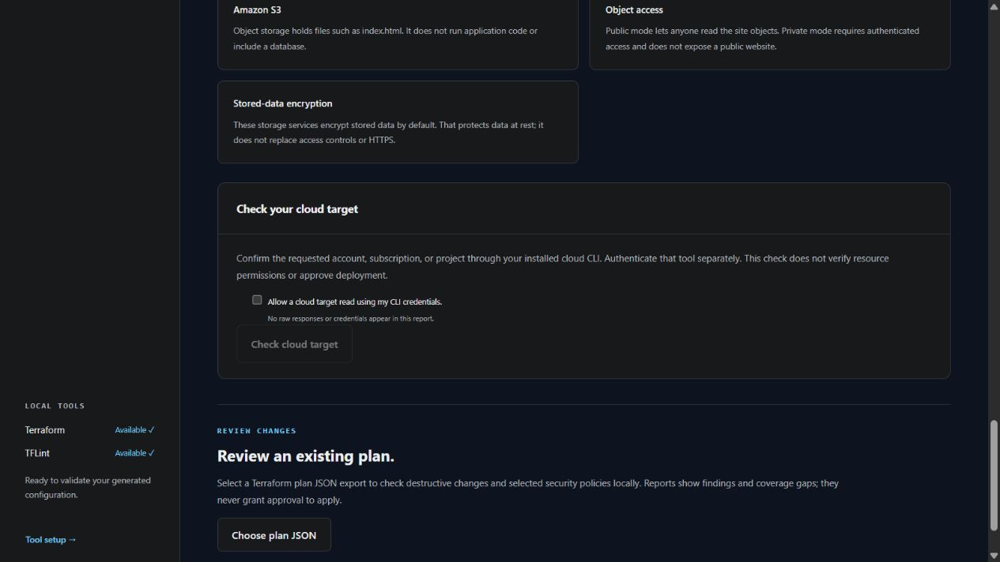
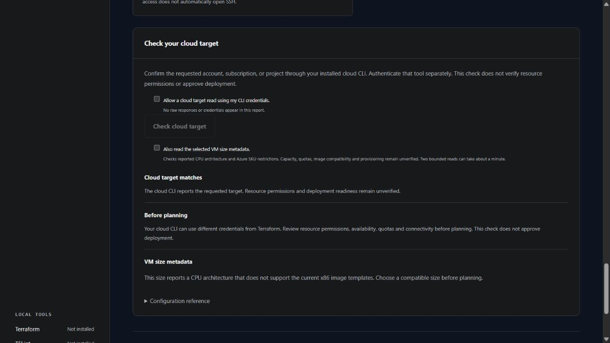
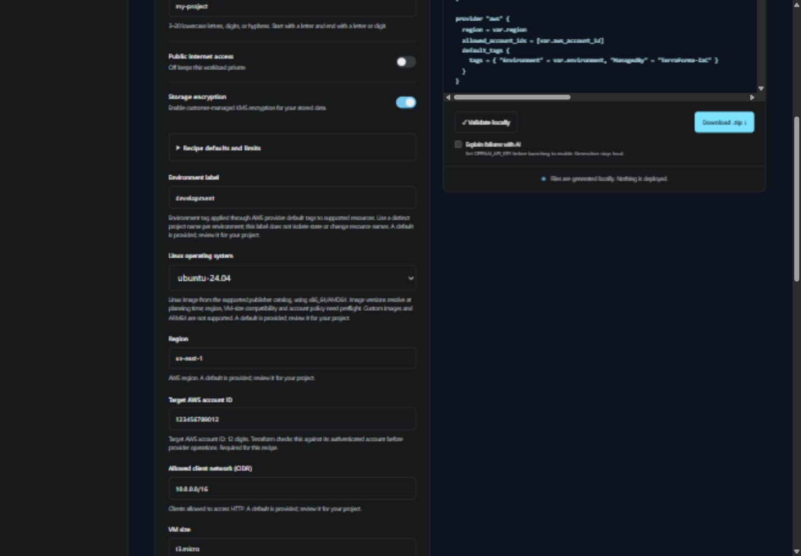
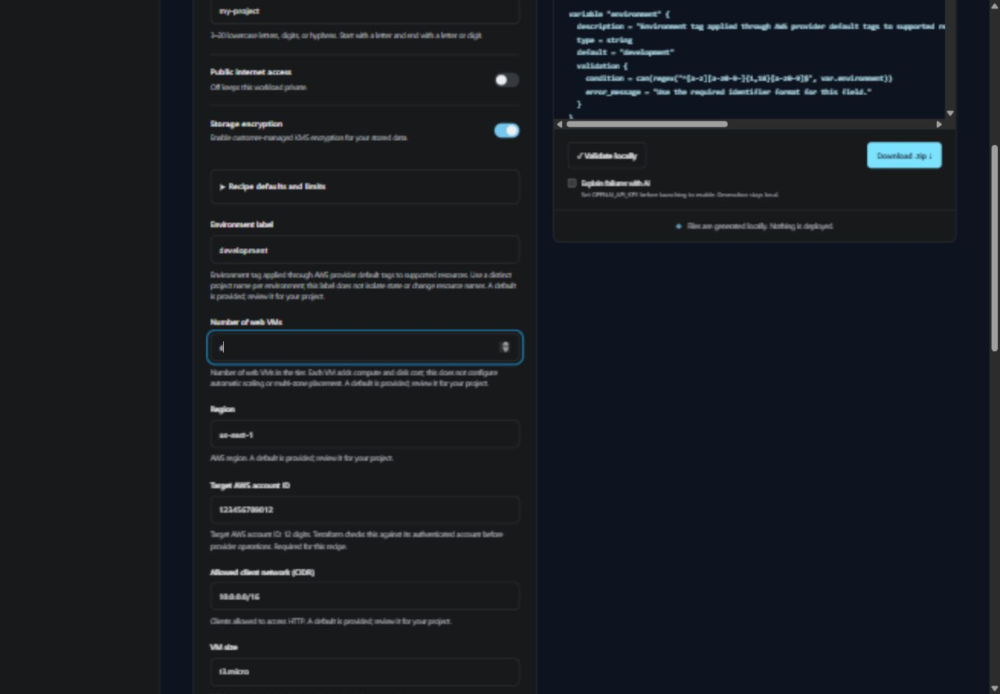

# Project specifications

Available on `main` during v0.3 development. The v0.2.0 release does not include this workflow.

A project specification records a recipe and its non-secret Terraform inputs. The browser Configure step and terminal `terraforma wizard` ask about each declared variable using the same contract. Required answers must be supplied; defaults can be reviewed and changed. Generation, local validation, and download use those same answers. Sensitive fields show an external environment-variable reference instead of asking for a password.

If an answer fails a field check, the interfaces identify the declared field and a safe correction hint without repeating its submitted value. The browser focuses that field and clears its validation error when you edit it. Unknown or secret input names and malformed project files receive a generic error. No native validation starts for invalid project inputs.

```json
{
  "schema_version": 1,
  "template_version": "0.3.0.dev0",
  "recipe": {
    "provider": "aws",
    "project_name": "first-site",
    "architecture_type": "static_site",
    "is_public": false,
    "enable_encryption": true
  },
  "inputs": {
    "environment": "development",
    "aws_account_id": "123456789012",
    "region": "us-west-2",
    "index_html": "<html><body><h1>Hello</h1></body></html>"
  },
  "secret_references": {}
}
```

Save this as `terraforma.project.json`, then inspect the recipe's declared inputs and generate files:

```text
terraforma project-inputs --spec terraforma.project.json
terraforma generate --spec terraforma.project.json --dir first-site
```

Terminal generation writes the three Terraform files, the non-secret specification, a generation receipt, and checksums into a fresh output directory. It refuses to overwrite an existing Terraform configuration or metadata file and rolls back partial output on failure. Browser downloads include the same artifacts plus a project guide. See [artifact comparison](ARTIFACTS.md). Optional remembered browser choices still save only the original questionnaire selections; additional input answers are not retained in browser storage.

After generation or import, **Your configuration choices** lists the effective answers without requiring you to read Terraform. The ZIP guide includes the same summary. `answer` means a value recorded in the saved questionnaire, even when you accepted a suggested default; `default` means an omitted input resolved through the recipe; `recipe` means a controlled value such as the project name. External secret requirements show environment-variable names, never their values. Page content and SSH keys receive short descriptions rather than full content. Long text is shortened only for display; the configuration keeps the full accepted value.

To review a saved questionnaire from the terminal without running Terraform or writing files:

```text
terraforma describe --spec terraforma.project.json
terraforma describe --spec terraforma.project.json --json-output
```

Generation also rejects common state files, variable-value files, `.terraform`, and the Terraform lock file in the destination. This prevents mixing a new questionnaire with an initialized project or saved values. The terminal wizard checks an explicit destination before asking questions. Use a fresh output directory; existing-project migration and managed updates are later lifecycle workflows.

Replace the example account ID with your intended AWS account. Every AWS recipe now requires a 12-digit `aws_account_id` and writes the provider's [account allowlist](https://registry.terraform.io/providers/hashicorp/aws/latest/docs/html) to guard later provider operations against an unintended authenticated account. Azure recipes require a subscription ID; GCP recipes require a project ID. The compiled result records that target and explicitly marks identity unverified. These fields are account references, not credentials; generation does not sign in or prove access. Earlier development AWS manifests need this new input added before they can compile or import.

To reopen a project, extract `terraforma.project.json` from its ZIP and select **Load project** in the browser. The file is validated locally before its answers and preview are restored. Imports never start validation or deployment, and do not enable AI or save additional answers in browser storage. Unsupported schema/template versions, duplicate JSON keys, missing answers, and files larger than 64 KiB are rejected. The development [AWS web-server example](../examples/aws-web.project.json) can be loaded the same way.

## Optional cloud target preflight



The browser shows **Check your cloud target** after generation or import. Enable the consent checkbox and select **Check cloud target** to request the same bounded cloud read. Consent resets after each attempt. Editing any questionnaire answer removes the previous result; generate again before checking the new target. The button stays disabled until you give fresh consent.

On development `main`, `terraforma preflight --spec terraforma.project.json` validates the saved project and reports `not_checked` without discovering or running cloud tools. To request a cloud read using the installed CLI's existing credentials:

```text
terraforma preflight --spec terraforma.project.json --verify-target
terraforma preflight --spec terraforma.project.json --verify-target --json-output --timeout 30
```

| Provider | Read performed | Target confirmation criterion |
| --- | --- | --- |
| AWS | [STS caller identity](https://docs.aws.amazon.com/cli/latest/reference/sts/get-caller-identity.html) through `aws` | Reported caller account equals the requested 12-digit account ID |
| Azure | [Subscription GET](https://learn.microsoft.com/en-us/rest/api/resources/subscriptions/get?view=rest-resources-2022-12-01) through `az rest` | Subscription ID matches and state is `Enabled` |
| GCP | [Project metadata](https://docs.cloud.google.com/sdk/gcloud/reference/projects/describe) through `gcloud projects describe` | Project ID matches and lifecycle state is `ACTIVE` |

Install and authenticate the official cloud CLI separately. AWS uses the standard partition's global STS endpoint and `us-east-1` signing region; other partitions require future adapters. Azure uses the CLI's configured ARM endpoint. Azure states other than `Enabled` require attention under this initial policy, even when some operations might remain available.

Opt-in checks run in a temporary working directory with closed stdin, a default 30-second timeout (up to 120 seconds), and at most 128 KiB captured per output stream. TerraForma omits raw responses, diagnostics, discovered executable paths and principal details from reports. It removes OpenAI and Terraform variable/argument environment settings from the cloud subprocess; the cloud CLI retains its own credential configuration and may refresh authentication caches or write its usual logs. Absolute credential/config paths are preferable because the subprocess uses a temporary directory.

Exit `0` means the check was skipped or the CLI reported a matching target; other check outcomes return exit `1`. `target_confirmed` establishes only the documented CLI-reported target check. Terraform can use different credentials or cloud endpoints, and executable/endpoint trust, resource permissions, regions, images, SKUs, quotas and connectivity remain unverified. The report includes the normalized specification digest, never grants approval, and does not alter saved questionnaires, initialize Terraform, or run plan/apply/destroy. Treat it as a separate, limited preflight rather than a provisioning gate.

### Optional VM size metadata

For Azure standalone VMs, the same SKU response also checks reported `HyperVGenerations` and `TrustedLaunchDisabled`. The generated Gen2 image and retained vTPM require Trusted Launch support even when Secure Boot is disabled. A reported unsupported size yields `boot_features_incompatible`; missing generation evidence yields `boot_features_unknown`. This follows [Microsoft's SKU guidance](https://learn.microsoft.com/en-us/azure/virtual-machines/trusted-launch-faq#how-can-i-find-vm-sizes-that-support-trusted-launch) and adds no extra cloud request. Image support, capacity, quotas and effective cloud settings remain unverified.

When `enable_accelerated_networking` is enabled for an Azure standalone VM, that same response checks `AcceleratedNetworkingEnabled`. Explicit support is reported as `accelerated_networking_compatible`; an unsupported or missing capability yields `network_features_incompatible` or `network_features_unknown` respectively. Malformed or duplicate capability values fail closed. CPU architecture, restrictions and boot checks retain priority. The option defaults off and adds no cloud request; advertised support does not verify guest drivers or deployment readiness.

Azure compute recipes with storage encryption enabled also check `EncryptionAtHostSupported` in that SKU response. `host_encryption_compatible` records the result; unsupported or missing metadata yields `encryption_features_incompatible` or `encryption_features_unknown`. Duplicate, non-string or unsupported values fail closed. Proven feature incompatibilities are reported ahead of missing feature evidence; CPU architecture and SKU restrictions retain priority. This adds no request and does not check subscription feature registration, quotas or disk compatibility. Follow [Microsoft's encryption-at-host prerequisites](https://learn.microsoft.com/en-us/azure/virtual-machines/linux/disks-enable-host-based-encryption-cli) separately; the tool neither registers subscription features nor changes cloud resources.

Standalone VM recipes accept `private_ip_address`: leave it empty for cloud allocation, or supply one fixed IPv4 address. The compiler and generated Terraform preconditions check subnet membership and reserved addresses. AWS uses the first public subnet (`cidrsubnet(network_cidr, 8, 0)`) or first private subnet (`cidrsubnet(network_cidr, 8, 10)`), according to the access choice. Azure uses `cidrsubnet(network_cidr, 8, 1)`; GCP uses `network_cidr` directly. [AWS](https://docs.aws.amazon.com/vpc/latest/userguide/subnet-sizing.html) and [Azure](https://learn.microsoft.com/en-us/azure/networking/design-guide/ip-planning) reserve the first four and last address; [GCP primary subnets](https://docs.cloud.google.com/vpc/docs/subnets) reserve the first two and last two. The option neither checks current address availability nor creates an independent reservation. Changes can interrupt access or replace resources; review the plan.

Standalone AWS VMs expose `boot_disk_iops`/`boot_disk_throughput` and `data_disk_iops`/`data_disk_throughput` for gp3 disks. Fields appear only for the matching disk class, with data-disk fields also requiring the disk to be enabled. Defaults retain the included 3,000 IOPS and 125 MiB/s baseline. Template ranges are 3,000–16,000 IOPS and 125–1,000 MiB/s; these are narrower than [AWS's current gp3 service limits](https://docs.aws.amazon.com/ebs/latest/userguide/general-purpose.html). Compilation and Terraform preconditions enforce no more than 500 IOPS per GiB and throughput no greater than one quarter of provisioned IOPS. Non-baseline performance answers for disabled or non-gp3 disks are rejected by the compiler. Extra performance adds charges; achieved performance also depends on instance EBS limits and workload behavior. No performance benchmark, availability check or pricing estimate is performed.

For compute recipes, select **Also read the selected VM size metadata** in the target-check card. Both checkboxes start unchecked and reset after an attempt. This requests one additional cloud read only after the target matches. Editing a questionnaire answer clears the earlier results. No VM metadata read runs for database or static-site recipes.

```text
terraforma preflight --spec terraforma.project.json --verify-target --verify-machine --json-output
```

`--verify-machine` requires `--verify-target`. Each read has its own configured timeout/output bounds, so the default two-read workflow can take about a minute. Without the additional flag, existing target checks perform only their original read.

| Provider | Additional read | Metadata inspected |
| --- | --- | --- |
| AWS | [EC2 instance type description](https://docs.aws.amazon.com/cli/latest/reference/ec2/describe-instance-types.html) in the requested region | Exact instance type and reported support for `x86_64` |
| Azure | [VM SKU list](https://learn.microsoft.com/en-us/cli/azure/vm?view=azure-cli-latest#az-vm-list-skus) with explicit subscription/location/size and restricted entries included | Exact VM SKU/location, reported `x64` CPU architecture and any location/zone restrictions |
| GCP | [Machine type description](https://docs.cloud.google.com/compute/docs/reference/rest/v1/machineTypes) with explicit project/zone | Exact machine name/zone, reported x86 architecture and deprecation state |

The nested `machine_check` reports `metadata_confirmed`, `architecture_incompatible`, `architecture_unknown`, `restricted`, `not_found`, `failed`, `invalid_response`, `not_checked` or `not_applicable`. Missing architecture is a review gap, never an inferred success. Azure restrictions are treated conservatively, including zone restrictions even though current recipes do not select a specific Azure zone. GCP deprecated sizes require review. All metadata is read through the existing trusted CLI; raw responses and restriction details are omitted.

When requested, CLI exit `0` additionally requires `metadata_confirmed` or `not_applicable`; other VM metadata outcomes return exit `1`. A matching target can still have an incompatible or unresolved VM size. Reports never approve deployment. These reads do not establish allocation capacity, quotas, actual image/driver/disk compatibility, Terraform credential equivalence, IAM permissions or connectivity. Azure documents that [a listed SKU can still fail allocation](https://learn.microsoft.com/en-us/azure/azure-resource-manager/troubleshooting/error-sku-not-available).



The screenshot demonstrates an incompatible architecture using mocked CLI responses. Live cloud metadata reads and provisioning remain unverified in this development checkpoint.

## Secrets and validation

Answers use the type declared by the recipe contract. Boolean questions require actual JSON `true` or `false`; strings such as `"false"` and numeric values are rejected. AWS VM and web-tier recipes expose `detailed_monitoring`, disabled by default, and retain that choice through both questionnaires and project import/export. See [monitoring behavior and costs](LINUX_VM.md#provider-access).

Sensitive variables remain required Terraform variables without generated defaults. The contract identifies their `TF_VAR_...` environment variable. A database recipe can record `"secret_references": {"database_password": "TF_VAR_database_password"}`; it must not include the password value in `inputs`. The tool does not read that environment variable during generation.

Unknown input names, private keys, secret values in declared sensitive fields, missing required non-secret inputs, invalid UUID/CIDR formats, and incompatible GCP region/zone combinations are rejected. Request/CLI errors omit input values. This is not a general detector for secrets hidden in arbitrary non-secret text such as website HTML; review manifests and generated files before sharing them.

Azure SSH inputs accept OpenSSH Ed25519 or RSA public keys, matching [Microsoft's supported formats](https://learn.microsoft.com/en-us/azure/virtual-machines/linux/create-ssh-keys-detailed). The validator checks base64 encoding, algorithm identity, binary field lengths, and RSA integers with a minimum 2048-bit modulus. This is structural validation, not proof of key ownership, cryptographic validity, or successful VM authentication. Private keys, authorized-keys options, ECDSA, truncated blobs, and trailing fields are rejected.

## Current scope

The contract is derived from the actual variables declared by the existing recipes, so their questions and HCL variables stay aligned. It does not expose settings still fixed by those recipes, such as custom image IDs, subnet count, and availability layouts. The complete VM adapter work remains on the roadmap.

Standalone Linux VMs expose `network_cidr` for a newly created private IPv4 network. AWS/Azure accept `/16` through `/20` and derive subnets; GCP accepts `/16` through `/28` for its regional subnet. Shared input checks and generated Terraform enforce canonical RFC1918 ranges without host bits. See [network ranges and layouts](LINUX_VM.md#new-network-address-range). Existing-network overlap and connectivity remain manual preflight checks.

For standalone VMs, `enable_workload_identity` defaults to false. AWS/GCP expose a `workload_identity` reference with matching `visible_when` and `required_when` conditions. Its empty Terraform default is an inactive sentinel, never a usable identity: enabling the option requires a nonempty valid reference, checked by the compiler and a generated resource precondition. The browser and CLI ask for this reference only when enabled. Azure instead creates an optional system-assigned principal without role assignments. See [workload identity choices](LINUX_VM.md#workload-identity).

Existing compute recipes now expose VM size, boot-disk size, and supported disk classes. Boot sizes are whole numbers in a bounded range: 20–2048 GiB for AWS/GCP and 30–2048 GiB for Azure. These are the current recipe limits, not universal cloud limits. Both the contract and generated Terraform enforce them. The selected image can impose a higher minimum, and live account/SKU/storage compatibility still requires preflight.

Standalone Linux VMs also expose `enable_data_disk`, default `false`. Its dependent `data_disk_size_gb` and `data_disk_type` questions appear only when enabled, using contract `visible_when` metadata. Sizes are 32–2048 GiB; available types depend on the provider. The CLI skips inactive questions; browser exports omit inactive answers and use recipe defaults for their unused Terraform variables. All supplied manifest values are still validated, including inactive fields. The configuration summary omits inactive disk size/type choices. See [data disk behavior and limits](LINUX_VM.md#optional-data-disk).

Generation is offline. Provider permissions, account identity, live image/SKU availability, quotas, and deployment are not established by the input checks. Schema/template versions are recorded; the current development workflow does not yet promise cross-version migration or reproducible generation across changing development commits.

## Environment labels

Every recipe exposes a defaulted `environment` input, using 3–20 lowercase letters, digits, or hyphens. The contract and Terraform enforce the same format. AWS uses provider default tags for supported resources; Azure tags the resource group only, whose tags do not automatically propagate to its resources; GCP labels the generated VM/template, Cloud SQL settings, or storage bucket. Network/supporting resources without label support are not covered.

The label appears in compiled target metadata and the project guide. It does not isolate credentials or state and does not change resource names. Use distinct project names for distinct environments until the multi-environment/state workflow is implemented.

## Recipe capabilities

### Azure administrator username

Azure compute recipes ask for `admin_username`, defaulting to `terraforma`. This recipe accepts 3–32 lowercase letters, digits, underscores, or hyphens, starting with a letter and ending with a letter or digit. Both the questionnaire and Terraform reject the [Azure reserved-name list](https://learn.microsoft.com/en-us/azure/virtual-machines/linux/faq), including `root` and `admin`. The narrower character/length format is a recipe choice. The answer configures the VM or scale set and its SSH public-key username; standalone VMs also return it as `ssh_username`. Password authentication remains disabled.

### Linux image selection

AWS compute recipes expose `image_version`: `latest` (default) or an exact AMI ID in the chosen region. The `aws_ami` lookup retains the selected OS name filter, Amazon/Canonical owner constraint, HVM and explicit x86_64 architecture filters, then adds an image-ID filter for a pin. A nonmatching or unavailable pin cannot fall back to another image. Review [AMI lookup behavior](https://docs.aws.amazon.com/AWSEC2/latest/APIReference/API_DescribeImages.html), launch permissions, deprecation, regional availability and compatibility before planning. Pinning is not an image-integrity certificate or an automatic patching policy. Changing an AMI can replace the VM and lose boot-disk data.

GCP compute recipes expose `image_version`: `latest` (default) or an exact supported Debian 12 Bookworm / Ubuntu 24.04 Noble image name. The publisher project remains `debian-cloud` or `ubuntu-os-cloud`, selected by `os_image`. ARM names, URLs, custom projects and mismatched OS names are rejected; generated Terraform also checks that the version matches the selected OS. Verify availability, deprecation, actual architecture and compatibility before deployment. Exact names follow the supported [GCP naming conventions](https://docs.cloud.google.com/compute/docs/images/os-image-lifecycle); a pin does not automatically patch a VM or establish image integrity. Changing an image can replace the VM and lose boot-disk data.

Azure compute recipes expose `image_version`: `latest` (default) or a numeric `Major.Minor.Build` version for the selected Canonical offer/SKU. The shared questionnaire and Terraform variable validation reject other formats. An exact version avoids selecting a newer image build on a later plan, but does not establish regional availability, publisher integrity, VM compatibility or deployment readiness. Changing the image can replace a VM and destroy its boot-disk data; review the resulting plan and recovery requirements. Custom/gallery images remain planned. Azure's [image-reference contract](https://learn.microsoft.com/en-us/rest/api/compute/virtual-machines/list?view=rest-compute-2026-04-01) documents exact versions and `latest`; using `latest` does not automatically patch an existing VM.

Azure standalone VMs also expose `enable_boot_diagnostics`, defaulting to `false`. Enabling it adds boot console output/screenshots using Azure-managed diagnostic storage, without a custom storage account or exported diagnostic URL. Console output can contain sensitive data: review cloud read access and avoid printing secrets. [Microsoft documents](https://learn.microsoft.com/en-us/azure/virtual-machines/boot-diagnostics) that managed diagnostic blobs are currently not billed, retention cannot be configured, and logs are overwritten above 1 GB. Verify current terms before deployment. Application logging, alerts, guest attestation and a durable audit archive remain outside this feature.

Azure standalone VMs expose `enable_secure_boot`, defaulting to `true`, and retain `vtpm_enabled = true`. Both supported Ubuntu images use Gen2 marketplace offers. Review [Trusted Launch support](https://learn.microsoft.com/en-us/azure/virtual-machines/trusted-launch) for the selected size and image; unsigned kernel drivers can prevent booting. Guest attestation and Defender monitoring are not configured. Disabling Secure Boot retains vTPM and requires a separate workload/security decision. The [AzureRM Linux VM schema](https://registry.terraform.io/providers/hashicorp/azurerm/latest/docs/resources/linux_virtual_machine) defines these controls; structural validation does not prove successful deployment.

Compute recipes expose `os_image` as a supported choice, shared by terminal and browser forms. The selected image also determines the AWS package-manager startup script.

| Provider | Choices | Publisher constraint |
| --- | --- | --- |
| AWS | `amazon-linux-2023` (default), `ubuntu-24.04` | Amazon-owned AL2023 x86_64 AMIs, or Canonical owner `099720109477` with the Ubuntu Noble AMD64 server filter |
| Azure | `ubuntu-22.04` (default), `ubuntu-24.04` | Canonical marketplace Gen2 AMD64 server offers; Ubuntu 24.04 uses `ubuntu-24_04-lts:server` |
| GCP | `debian-12` (default), `ubuntu-24.04` | `debian-cloud/debian-12` or `ubuntu-os-cloud/ubuntu-2404-lts-amd64` |

The catalog accepts these image selectors only. Windows, ARM64, arbitrary image IDs, and custom publishers require future adapters. The default latest selection resolves at planning time; each provider can instead request its supported exact image pin. A matching specification or receipt cannot establish an image's availability or integrity. Verify regional availability, machine architecture, publisher trust, organizational policy, and the exact resolved image in your Terraform plan before deployment. AWS Ubuntu ownership here is for the standard AWS partition; other partitions require separately reviewed identifiers.

Reference identifiers are based on the official [HashiCorp AWS tutorial](https://docs.hashicorp.com/terraform/tutorials/aws-get-started/aws-create), [Canonical Azure catalog](https://ubuntu.com/azure/docs/azure-how-to/instances/find-ubuntu-images/), and [Google Compute Engine OS documentation](https://docs.cloud.google.com/compute/docs/images/os-details?hl=en). Local schema and selector checks do not establish cloud availability or successful boot/access.



### Tier capacity

Load-balanced compute recipes ask for `instance_count`, a whole number from 2 to 20 with a default of 2. The answer controls EC2 instances and target attachments, Azure scale-set instances, or the GCP managed instance-group target size. Single-server recipes keep exactly one VM and reject this extra input. This is initial capacity; autoscaling and custom placement are not configured. AWS distributes instances across its two generated subnets; Azure and GCP retain their existing recipe placement. Check quotas, availability, and per-instance compute/disk costs before deploying.



### Database client access

Database recipes constrain client networks in both questionnaires and generated Terraform. AWS database client CIDRs and public GCP database client CIDRs accept an RFC1918 private subnet (`10/8`, `172.16/12`, or `192.168/16`) or an IPv4 `/24`–`/32` network. Prefer `/32` for a single public client. Larger public ranges require a separately reviewed configuration; this is a TerraForma recipe policy, not a cloud provider limit. Public HTTP web-server ranges use their own policy and can still accept `0.0.0.0/0`.

The public Azure database recipe accepts one client IPv4 address and rejects `0/8`, loopback, multicast, and reserved `224/3` addresses. In particular, it rejects `0.0.0.0`, which Azure interprets as [access from Azure services](https://learn.microsoft.com/en-ie/azure/postgresql/flexible-server/security-firewall-rules). Syntax and range checks do not establish that an address belongs to the user or is reachable. Private cloud networking and connection routing still need review.

The Configure step includes an expandable **Recipe defaults and limits** section. It identifies supported operating systems, fixed initialization/network layouts, capacity limits, and features outside the selected recipe. ZIP project guides include the same information.

Use `terraforma catalog` for a readable catalog or `terraforma catalog --json-output` for structured metadata. The local API exposes the same catalog at `/api/catalog` and includes selected capabilities in input contracts and compiled project responses. Account and deployment checks remain explicitly unverified until a future account preflight workflow establishes them.
