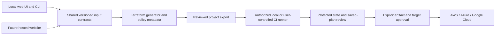

# TerraForma-IaC roadmap

## Product direction

TerraForma-IaC will become a guided infrastructure workspace for AWS, Azure and Google Cloud. Users enter provisioning requirements, review explained defaults and generate readable Terraform without needing to write HCL. The lightweight local application remains supported alongside a future hosted website.

The stable product connects **configure and export**, **review and approve**, and **provision through a controlled runner**. Each supported pattern has complete input questions, clear limits and appropriate verification evidence. Unsupported requests remain visible; catalog expansion continues after the stable release.

## Current phase

| Milestone | Details |
| --- | --- |
| **Now** | **Phase 2: Complete VM configuration** |
| **Status** | **Phase 1 release gates complete; Phase 2 in development** |
| **Latest release** | [v0.3.0](https://github.com/chriswayneh/TerraForma-IaC/releases/tag/v0.3.0) — reusable projects and local security review |
| **Current target** | **v0.4.0** |
| **Next user milestone** | Configure supported Linux and Windows VMs without editing Terraform in v0.4.0 |
| **Release blocker** | Dedicated AWS/Azure/GCP accounts and separately authorized live creation, login, initialization and cleanup evidence |
| **Final milestone** | **v1.0.0: stable local and hosted infrastructure workspace** |

TerraForma-IaC already generates Terraform recipes through a local web UI and CLI. It explains the resources, exports the files, validates trusted configurations, and provides an initial local plan reviewer. [Start with the current release](GETTING_STARTED.md).

The next stages turn that workflow into a guided provisioning platform. Users describe what they need to provision; the interface asks the operational questions and produces the configuration. Simple mode explains defaults, while advanced mode exposes supported provider-specific choices.

### Foundation work continuing in later phases

- Extend the initial shared project specification to account/environment identity and resource dependencies.
- Extend the implemented recipe input contracts as the resource catalog grows.
- Extend account-specific capability preflight beyond target identity, optional VM-size metadata, AWS boot/disk encryption and selected zone checks, and the development [image metadata checks](IMAGE_PREFLIGHT.md). Missing image fields remain unknown; live boot, capacity, quotas and Terraform credential equivalence remain unverified.
- Extend declared disk-key review beyond GCP boot/persistent disk references to effective key ownership, permissions and recovery evidence. Current local checks never grant deployment approval.
- Artifact, credential, state, and execution controls needed before adding apply.

The current release does not collect every VM setting or execute plan/apply/destroy operations. Cloud deployment and live OpenAI requests remain unverified.

## Planned releases

Versions are targets, not date promises. A release ships only after its documented security, compatibility, and acceptance checks pass.

| Status | Version | Phase | Outcome |
| --- | --- | --- | --- |
| **Released** | [v0.2.0](https://github.com/chriswayneh/TerraForma-IaC/releases/tag/v0.2.0) | Guided workspace | Generate, understand, export, validate, and locally review Terraform recipes |
| **Released** | [v0.3.0](https://github.com/chriswayneh/TerraForma-IaC/releases/tag/v0.3.0) | [1 · Security and project foundation](#phase-1) | Shared project specification, declared recipe input contracts, and local execution safeguards |
| **In progress** | v0.4.0 | [2 · Complete VM configuration](#phase-2) | Guided Linux/Windows VM inputs across AWS, Azure, and GCP |
| Planned | v0.5.0 | [3 · Networks, storage, and identity](#phase-3) | Compose connected resources with explicit access and identity decisions |
| Planned | v0.6.0 | [4 · State and plan workflow](#phase-4) | Protected state, account preflight, saved plans, and change review |
| Planned | v0.7.0 | [5 · Approved local provisioning and lifecycle](#phase-5) | Approve and apply reviewed plans through a local runner; manage updates and controlled teardown |
| Planned | v0.8.0 | [6 · Multi-environment automation](#phase-6) | Environment reuse, optional Terragrunt, and protected CI workflows |
| Planned | v0.9.0 | [7 · Broader workload catalog](#phase-7) | Individually verified database, TLS, container, and serverless patterns |
| Planned | v0.10.0 | [8 · Hosted generator](#phase-8) | Configure, preview and download Terraform from a website |
| Planned | v0.11.0 | [9 · Team workspace and runners](#phase-9) | Collaborate and request approved operations on user-controlled runners |
| Planned | v1.0.0 | [10 · Stable platform](#phase-10) | Verified local/hosted workflows, stable contracts, recovery and cross-platform support |

Hosted generation can be developed independently while live cloud acceptance is pending. It does not clear the v0.4.0 gates or justify publishing an unverified release. Runner integration depends on the state, lifecycle and automation controls in Phases 4–6.

## Final user journey

| Step | User action | Product support |
| --- | --- | --- |
| Select | Choose provider, environment and workload | Scope, prerequisites and verification status |
| Configure | Enter variables and review optional settings | Conditional questions, explained defaults and validation |
| Preview | Inspect resources, access and ownership | Readable Terraform, relationships and unresolved checks |
| Export | Download or save a project | Versioned specification, Terraform and integrity receipts; optional Terragrunt |
| Review | Connect an explicitly selected execution target | Account preflight, protected state, saved plan and policy findings |
| Approve | Confirm exact changes and target | Approval bound to the artifact and permitted operation |
| Operate | Execute through an authorized local or CI runner | Progress, redacted history and recovery guidance |

Only implemented steps are available today. The first hosted version offers configuration, preview and export without collecting cloud credentials or running Terraform plugins.

## Explore the project

| I want to… | Read |
| --- | --- |
| Try the released workflow | [Getting started](GETTING_STARTED.md) |
| See the interface | [Screenshots](../README.md#screenshots) |
| Understand the system | [Architecture](ARCHITECTURE.md) |
| Check what was verified | [Verification record](VERIFICATION.md) and [release checks](https://github.com/chriswayneh/TerraForma-IaC/actions/runs/37558709785) |
| Understand the latest release | [v0.3.0 release notes](RELEASE_0.3.0.md) and [changelog](../CHANGELOG.md) |
| Review the VM questionnaire design | [VM inputs](VM_INPUTS.md) |
| Understand local policy checks | [Plan review](PLAN_REVIEW.md) |
| Report a security concern | [Security policy](../SECURITY.md) |

## Phase details

The catalog will expand through documented, tested resource patterns. Unsupported requests remain visible rather than silently producing incomplete configurations.

## Phase 1: Security and project foundation

Target: **v0.3.0**.

Status: release gates complete for v0.3.0. Local plan review in both interfaces, bounded API requests, explicit AI opt-in, a shared project specification/input contract, and recipe capability metadata are implemented. Both questionnaires ask for declared recipe variables; the browser preserves answers through generation, validation, export, and project import. Target account references and environment labels are recorded but not authenticated. The local `doctor` command checks package/PATH availability; explicit consent in the browser or CLI can check the target through AWS caller-account, Azure subscription, or GCP project metadata reads. Completion means the exit criteria below are met; it does not establish deployment readiness. Resource graphs, Terraform credential equivalence, broader account capability checks, atomic publication and protected execution/state controls continue in their later roadmap phases.

- Define a versioned project specification shared by the CLI, UI, generator, and automation API.
- Record provider, account identity, environment, resource selections, dependencies, and template versions without persisting credentials.
- Add explicit capability metadata so supported, unsupported, and unverified configurations are distinguishable.
- Maintain one input contract per catalog entry: each configurable field has a plain-language question, type, validation, conditional dependencies, an explained default or required answer, and a sensitive-value handling rule. The UI and generated variables use this same contract so questions cannot drift from output.
- Add local policy review for Terraform plan JSON: destructive changes, broad network access, missing protections, and unresolved policy coverage.
- EC2 metadata token response hop limits above one now require manual workload-isolation review. Missing, unknown and malformed controls remain visible review gaps; this does not establish live credential access or IAM permissions.
- Initial managed disk access review covers Azure remote import/export and public network settings. Effective permissions, private endpoints, encryption and backup/recovery still require separate review.
- Apply resource-specific encryption and access defaults; explain unavoidable provider defaults.
- GCP standalone boot/data disks can reference one existing Cloud KMS CryptoKey without managing key lifecycle or IAM grants. Location compatibility, service-agent access, key state and recovery remain unverified.
- Local plan policy 0.11.0 flags GCP disk key-access review, blocks changes to existing references and inline customer-supplied key material, and handles unresolved/malformed controls without exposing values. Effective encryption and recovery remain outside these checks.
- Preserve existing provider locks during validation with read-only initialization. Missing locks, remote module content trust and independently reviewed dependency upgrades remain explicit boundaries.
- Bound request bodies, configuration sizes, subprocess duration, and job concurrency.
- Keep cloud credentials in provider credential chains; make AI transmission opt-in throughout the product.
- Specify artifact permissions, log redaction, state ownership, dependency trust, and recovery behavior before adding apply.
- The [state protection design](STATE_PROTECTION.md) records planned backend inputs, separate backend/workload identity, locking, retention, migration and recovery acceptance requirements. Backend integration and live verification remain planned.
- An offline `check-backend` contract validates non-secret S3/Azure Blob/GCS intent files, requires declared S3 lockfile use and omits location values from its report. It never configures a backend or verifies cloud access; integration remains planned.
- The terminal `backend-wizard` and local web UI now collect those inputs through guided questions and save/download a separate intent file. Generated backend configuration and verified authentication/locking/recovery remain planned.
- The browser can reload saved backend intents with bounded schema validation and requires a new check before downloading. Failed imports preserve current entries; imports never configure storage or verify cloud access.
- Both storage questionnaires provide format hints. Browser checks identify known invalid fields without repeating values; unknown or credential fields retain generic errors.
- Terminal artifact generation has documented creation permissions and best-effort failure/interruption cleanup, including explicit leftover-file errors. Protected state and atomic/durable execution artifacts remain outstanding. See [artifact handling](ARTIFACTS.md).
- Terminal output now flushes and synchronizes each generated file before reporting success. Synchronization failures follow existing cleanup/recovery rules; directory synchronization and atomic project publication remain outstanding.

Exit criteria: invalid specifications fail closed; review reports expose no raw plan values; policy decisions have meaningful tests; current behavior and remaining security gaps are documented. No apply endpoint is introduced in this phase.

## Phase 2: Complete VM configuration

Target: **v0.4.0**.

Status: initial Linux patterns and [AWS/Azure/GCP Windows Server 2022 recipes](WINDOWS_VM.md) are in development alongside the foundation. [Standalone Linux VM recipes](LINUX_VM.md) collect region, supported Linux image, VM size, boot-disk size/type, one optional empty data disk, a new private network address range, optional workload identity, and restricted administrator access. Compute recipes now accept provider-specific exact image pins or latest; Azure standalone VMs expose optional managed boot diagnostics. AWS exposes detailed monitoring; AWS/GCP expose VM deletion protection. Azure and GCP expose Secure Boot with vTPM enabled; GCP also enables integrity monitoring. Optional data disk size/type questions appear only when enabled. Web tiers also expose their initial count. Guided existing-image references are available in v0.4.0 development for standalone Linux/Windows VMs. Broader VM configuration, network, identity policy, and lifecycle adapters remain planned; cloud creation/access/teardown has not been verified.

| VM input area | Development status | Remaining work |
| --- | --- | --- |
| Operating system and images | Catalog choices, guided existing-image references and separately consented [image metadata checks](IMAGE_PREFLIGHT.md), including AWS image/VM modes and GCP Shielded VM firmware | Missing metadata, access/guest-agent compatibility and live boot evidence |
| Capacity and disks | Machine size, boot disk, one optional data disk and documented provider choices | Broader disk/backup choices and live behavior |
| Workload identity | Existing AWS profile/GCP service account; Azure system or one existing user-assigned identity | Effective permissions and attachment evidence |
| Networks | New networks or one reviewed existing IPv4-only subnet on AWS, Azure and GCP | Broader composition, effective policy checks and live access |
| Tags and initialization | Environment and optional owner/application/cost-center labels; reviewed local shell/PowerShell initialization for standalone VMs | Live script execution, repeat/replacement behavior and broader label policies |
| Release acceptance | Structural, lint and local mocked checks | Dedicated account creation, Linux/Windows login, teardown and recovery evidence |

- Guided Linux and Windows VMs for EC2, Azure Virtual Machines, and Google Compute Engine.
- GCP standalone VMs support [one existing IPv4-only subnet](GCP_EXISTING_SUBNET.md) in the selected project/region, with explicit CIDR/review guards and no management of inherited rules, routing, NAT or API enablement. Shared VPC and live attachment/access/cleanup remain outstanding.
- Azure standalone Linux/Windows VMs support a system-assigned identity or [one existing user-assigned managed identity](AZURE_WORKLOAD_IDENTITY.md) in the selected subscription. Inactive and cross-subscription references fail closed; effective permissions, attachment and cleanup remain unverified.
- Guided [existing VM images](CUSTOM_IMAGES.md) support private AWS AMIs with owner and Linux administrator references, exact Azure Compute Gallery image-version resource IDs and exact GCP image references. Catalog conflicts and missing compatibility declarations fail closed. Image provenance, guest compatibility and live deployment remain unverified.
- Azure Windows generation uses the refreshed windowsserver2022 offer following legacy-offer deprecation. Existing-project image migration, regional version availability and application dependencies require separate review.
- Azure Windows VMs offer desktop or Server Core Gen2 installation options under the refreshed offer. Core application compatibility, regional image availability and guest boot require separate verification.
- AWS Windows VMs offer English Full Base or Core Base images, keeping Full Base as the default. Core application/tool compatibility, image availability and replacement recovery require separate verification.
- AWS standalone Linux/Windows VMs offer unmanaged, one-hop or two-hop IMDSv2 token response limits. Container credential access and effective account/AMI behavior require separate verification.
- AWS standalone gp3 boot/data disks accept regional tuning up to 80,000 IOPS/2,000 MiB/s with ratio checks. Outposts is unsupported; account availability and achieved instance/workload performance remain unverified.
- GCP Windows VMs expose latest or supported exact Windows Server 2022 Datacenter image names with a fixed publisher. Image availability, replacement recovery and live boot compatibility require separate verification.
- GCP Windows VMs offer desktop or Server Core installation options with matching family/pin guards. Guest application compatibility, activation and access remain unverified.
- AWS standalone Linux/Windows VMs expose optional standard availability zone names with automatic placement by default, matching subnet placement and planning guards. Account-specific zone mapping, capacity and replacement recovery remain unverified.
- AWS standalone VMs expose optional standard/unlimited CPU credit choices for x86 T2/T3/T3a/T8i families. The default leaves credit configuration unmanaged; performance, pricing and effective cloud settings remain unverified.
- Shared [machine architecture guards](MACHINE_ARCHITECTURE.md) reject documented Arm size identifiers in x86 recipes and generated variable overrides. Other sizes remain unverified until selected-account metadata and live acceptance checks.
- Azure standalone Linux/Windows VMs expose regional or single-zone placement with aligned disk, Standard NAT and public-IP settings; live zone support/capacity and replacement recovery require separate verification.
- GCP standalone Linux/Windows VMs expose host-maintenance and automatic-restart choices for standard instances; live event behavior and machine compatibility require separate verification.
- GCP standalone Linux/Windows VMs expose an optional [Google IAP administrator tunnel](GCP_IAP_ACCESS.md), preserving direct-network access by default. Narrowly targeted IPv4 proxy rules require manual plan review. Tunnel IAM and guest authentication remain separate; live access has not been verified.
- Azure standalone Linux/Windows boot and optional data disks expose supported host cache modes with durability guidance. Actual workload behavior and safe cache changes require live verification.
- Azure Windows offers automatic platform patch assessment separately from automatic OS installation; guest health, assessment and installation success remain unverified.
- Provider identity and region/zone selection; image families, supported custom images, machine size, architecture, and count.
- AWS standalone VMs offer [unmanaged or Dedicated Instance tenancy](AWS_TENANCY.md), preserving the unmanaged default. Dedicated Hosts/affinity remain unsupported; tenancy compatibility, capacity, licensing and effective placement require separate live verification.
- Boot/data disk size, type, encryption, managed-key references, and deletion behavior.
- AWS/GCP standalone boot disks expose a deletion/retention choice with existing deletion defaults. Data disks and encryption keys remain separate; live retention and restoration are unverified.
- New or existing networks/subnets, private/public addresses, explicit inbound rules, and egress choices.
- Development standalone VM recipes offer [outbound profiles](VM_OUTBOUND_ACCESS.md) for new networks: unrestricted ports or HTTPS/DNS with provider platform exceptions. Existing-network rules remain separately managed; custom destination/port policies and live effective connectivity remain outstanding.
- SSH public keys, identity-based access, or references to external secret mechanisms for Windows administration. The [Azure Windows credential design](AZURE_WINDOWS_DESIGN.md) documents the implemented external password reference, native provider state retention, and protected state controls still needed before managed deployment.
- Tags/labels, initialization scripts from trusted local files, availability choices, and explanations of cost drivers.
- Provider-aware questions and validation; advanced options stay behind progressive disclosure.
- Development browser questionnaires collapse optional operations/identity settings while keeping VM protection visible. Non-default imports reopen advanced settings for review; closed sections preserve values, and invalid required controls are revealed for correction.
- Existing web-server recipes become compositions of the same VM/network primitives.

Exit criteria: users can supply every required input for each documented VM pattern through the guided workflow. Structural/lint tests cover supported combinations. Dedicated test-account deployments verify Linux/Windows creation, access, and teardown; unsupported combinations are rejected explicitly.

Input-completeness gate: a user who understands provisioning can finish a supported VM configuration without editing HCL. Every supported operational choice is collected or explicitly defaulted, every generated variable has a supplied value/default/external-secret reference, and no hidden hardcoded image, size, network, or administrator choice is presented as configurable. Region/size/image availability is checked against the selected account before planning when credentials are available; offline generation labels those checks as outstanding.

The [v0.4.0 release-readiness audit](VM_RELEASE_READINESS.md) maps these requirements to offline evidence and outstanding live gates, including the actual six provider/OS variable inventories.

The offline combined-input matrix covers 36 provider/OS/access/network combinations with custom images, identity, data disks, labels and reviewed initialization enabled together. New networks exercise unrestricted and HTTPS/DNS profiles; AWS cases request Dedicated Instance tenancy. It checks exact exported defaults, external secret requirements and saved-project round trips, with native structural/lint validation. Eighteen terminal cases collect the same combined options from the questionnaire and reviewed local script file. These checks do not satisfy the dedicated-account creation, login, execution or cleanup gates.

## Phase 3: Networks, storage, and identity

Target: **v0.5.0**.

Status: planned.

- Compose VPC/VNet networks, subnets, routing, security groups/firewalls, NAT, and private endpoints.
- Object storage, managed disks, access policies, lifecycle settings, and backup choices.
- VM roles/service accounts/managed identities with least-privilege examples.
- Distinguish creation from use of existing resource IDs; inspect account permissions without silently granting more access.
- Resource dependency graph, compatibility checks, and provider-specific required-input forms.

Exit criteria: multi-resource projects generate consistent references, networking decisions are explicit, and network/access policy tests catch documented unsafe cases.

## Phase 4: State and plan workflow

Target: **v0.6.0**.

Status: planned; prerequisite for product-managed provisioning.

- Authenticated account preflight, environment selection, and clear target-account confirmation.
- Configure supported remote state backends with encryption, access controls, locking, and recovery documentation.
- Separate backend bootstrap from ordinary workloads; avoid storing backend credentials in configuration.
- Run trusted configurations through init, validate, lint, and saved-plan creation.
- Display creates, updates, replacements, deletes, costs/limitations, and policy findings in plain language.
- Protect plan/state artifacts and retain only necessary, redacted audit metadata.
- Bind review to the saved-plan digest, project/environment identity, configuration digest, and policy version; invalidate approval when those change.

Exit criteria: concurrent operations respect locks, drift and stale artifacts are handled, and review corresponds to the exact artifact intended for apply. Saved plans may contain secrets and must never be committed or sent to AI by default.

## Phase 5: Approved local provisioning and lifecycle

Target: **v0.7.0**.

Status: planned; requires verified state and plan controls.

- Apply only an explicitly approved saved plan to the confirmed account/environment.
- Apply authorization separate from generation; no hidden auto-approve behavior in the beginner workflow.
- Bounded execution, progress, cancellation, failures, and safe recovery instructions.
- Redacted local operation history and clear outputs without exposing sensitive output values.
- Separate destroy planning and explicit destructive approval; protect production environments and protected resources.
- Drift review and rerun workflows, with state-aware behavior and no assumption that partial apply rolled back.
- Establish these controls for a local runner before accepting remote operation requests from a hosted workspace.

Exit criteria: tests prove rejected/stale approvals cannot execute, failure does not become success, wrong-target operations are blocked, and dedicated cloud tests verify creation, updates, and cleanup. Cancellation is not described as rollback.

## Phase 6: Multi-environment automation and Terragrunt

Target: **v0.8.0**.

Status: planned; Terragrunt remains optional.

An initial development [Terragrunt exporter](TERRAGRUNT.md) provides local shared modules, independently configured units, external secret references and checksums. Remote state, dependencies, approvals and execution remain planned; this does not satisfy the phase exit criteria or the v0.4.0 live acceptance gates.

- Reusable project modules and dev/test/prod configuration overlays with isolated state.
- Generate Terragrunt units/stacks when resource dependencies and environment reuse justify them.
- Pin supported Terraform/Terragrunt versions and document generated layout.
- Dependency-aware planning and execution with an explicit selected scope; no accidental account-wide run-all.
- Per-unit plan review, approvals, failure reporting, and lock-aware concurrency.
- GitHub Actions with short-lived cloud identity via OIDC, pull-request plans, protected apply environments, and minimal token permissions.
- Scheduling integrates with the user's chosen runner; recurring destructive actions require an explicit policy.

Exit criteria: a sample multi-environment stack demonstrates ordering, independent state, approvals, retries/recovery, and target isolation. Plain Terraform projects remain fully supported.

## Phase 7: Broader workload catalog

Target: **v0.9.0**.

Status: planned; add individually verified capabilities rather than one universal template.

- Expand managed databases, private connectivity, backups, and restore workflows.
- Add TLS-enabled load balancing, DNS, certificates, autoscaling, and observability.
- Add container registries and supported managed container/Kubernetes patterns.
- Add supported serverless and scheduled-job patterns.
- Publish a compatibility matrix covering providers, resource families, OS/image support, execution modes, and verification status.
- Allow reviewed module extensions with pinned sources and explicit trust boundaries; arbitrary imports remain a trusted-user operation.
- Reuse free Terraform templates/modules where suitable, preserving license notices and source provenance. Review maintenance, provider compatibility, required inputs, access/encryption defaults, and execution hooks before adoption. Pin reviewed sources; free availability is not evidence of safety or compatibility.

Exit criteria: each catalog entry declares required inputs, policy coverage, cost drivers, tests, deployment evidence, and teardown/recovery instructions. Experimental entries are labeled visibly.

## Phase 8: Hosted generator

Target: **v0.10.0**.

Status: planned; the initial website generates and exports configurations.

Keep the lightweight local UI and CLI available. Shared input contracts and generation code serve both modes. Begin with transient projects and no mandatory account; persistent collaboration follows in Phase 9.

| Deliverable | Acceptance requirement |
| --- | --- |
| Guided website | Provider/workload selection, conditional forms, resource preview, bounded non-secret project import and ZIP export |
| Public-service boundary | Dedicated service design; local process tokens are not shared-service authentication |
| Privacy | No cloud credential collection, state/plan upload or server-side Terraform/provider-plugin execution in this phase |
| Protection | HTTPS, request/rate/concurrency limits, session isolation, abuse controls and minimal redacted logs |
| User experience | Responsive accessible forms, keyboard navigation, useful errors and clear support status |
| Hosting operations | Reviewed deployment configuration, dependency updates, rollback and retention/deletion rules |

Exit criteria: website generation/export agrees with local output; sessions cannot access one another's data; privacy, accessibility and security checks pass. Hosted AI assistance, if introduced, requires separate opt-in and explicit data disclosure. Hosting does not authorize cloud operations.

## Phase 9: Team workspace and runners

Target: **v0.11.0**.

Status: planned; execution integration requires the verified controls from Phases 4–6.

| Deliverable | Acceptance requirement |
| --- | --- |
| Saved workspace | Project history, template versions, configuration comparison and documented retention/deletion |
| Team access | Authentication, scoped membership/roles, project authorization and tenant isolation |
| Review workflow | Approval history, protected environment policies and exact artifact/target binding |
| Runner connection | Authenticated user-controlled local/CI runners with short-lived scoped identity |
| Operation requests | Replay protection, expiry, explicit authorization and redacted status; runner scope cannot expand through a request |

Exit criteria: cross-tenant access, approval bypass, replay and runner-scope failures are tested; dedicated accounts prove approved operations and cleanup. The hosted control plane does not receive long-lived cloud credentials. Hosted multi-tenant cloud execution is a separate future decision requiring stronger isolation and review.

## Phase 10: Stable platform

Target: **v1.0.0**.

Status: planned.

- Stable project schema, migrations, CLI/API contracts, and module compatibility policy.
- Windows, macOS, and Linux installation and end-to-end workflow evidence.
- Accessible web UI, export/import of non-secret specifications, recovery documentation, and reproducible examples.
- Dependency pinning and update process, supply-chain checks, supported versions, and security response process.
- Independently reviewed execution boundaries and policy gates; documented limits remain visible.
- Versioned releases, tested quickstart, complete architecture/runbooks, and contributor process.
- Hosted generation/export, team authorization and user-controlled runner workflows with privacy, accessibility and tenant-isolation evidence.
- Backup/restore, retention/deletion, incident handling and reviewed hosting rollback procedures.

Exit criteria: clean local installations and hosted sessions reproduce supported generation, review, plan, approved apply and cleanup workflows in dedicated accounts. Team isolation and recovery gates pass; exact-source release checks are verified. v1.0.0 is the stable product milestone, with maintenance and catalog expansion afterward. There are no claims of universal coverage or security certification.

## Architecture direction

This is the target architecture; hosted and execution stages are planned. [Architecture](ARCHITECTURE.md) describes the implementation and current local boundaries.

## Security gates across every phase

1. Generation is separate from execution. AI assists with explanations and drafting; it cannot approve a plan, choose a hidden target, or execute arbitrary commands.
2. Credentials and sensitive values do not enter browser storage or Git. External secret references are preferred; sensitive Terraform state and plans still require protection.
3. Network exposure and destructive changes are explicit decisions. Broad administrative access is blocked by default, and exceptions require visible, scoped justification.
4. Filesystem isolation is not a process sandbox. Native plugins execute code; untrusted modules require stronger isolation before they can become a supported product workflow.
5. Defaults reduce risk but are not deployment certification. Unknown policy coverage and unverified account capabilities remain visible and block automated approval.
6. Each phase must pass its exit criteria before being described as released. Release numbers are targets, not published artifacts or dates.
7. Hosted services require separately verified authentication, tenant isolation, abuse controls and privacy. Generation never runs user-selected modules/plugins; execution belongs to explicitly authorized runners.
8. Offline tests, metadata reads, mocked plans and live acceptance are distinct evidence levels. Missing accounts block live gates; separately scoped offline work can continue.

## Reference decisions

Terraform saved plans can include sensitive values and applying a saved plan executes its recorded changes without another Terraform prompt: [HashiCorp plan reference](https://developer.hashicorp.com/terraform/cli/commands/plan).

Terragrunt's run queue orders operations across dependent units; it supports the later multi-environment workflow rather than replacing the basic questionnaire: [Terragrunt run queue](https://docs.terragrunt.com/features/stacks/run-queue/).
