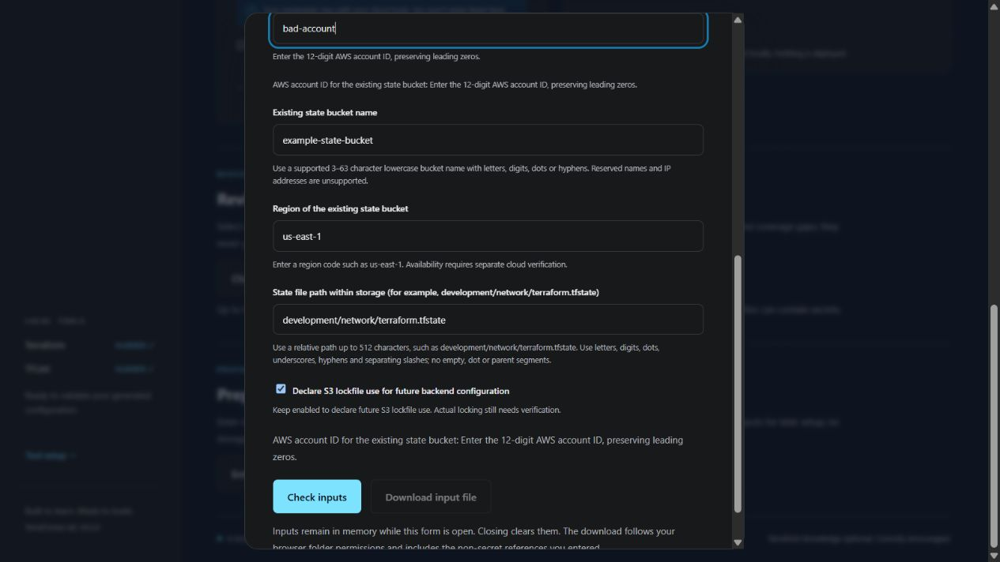

# State and recovery design

This is the design boundary for future managed provisioning. TerraForma currently generates configuration, validates trusted copies and reviews existing plan exports. It does not configure a remote backend, migrate state, acquire a deployment lock or run apply/destroy. A generated project is not a protected deployment workspace.

## Keep operational artifacts private

Terraform state and saved plans can contain credentials and resource secrets. Marking a variable `sensitive` hides ordinary console output but does not remove its value from state or plans. Ephemeral values and write-only arguments require compatible Terraform/provider features and permitted contexts; they cannot be assumed for every recipe. See [Terraform sensitive data handling](https://developer.hashicorp.com/terraform/language/manage-sensitive-data).

The current Azure Windows password reference avoids storing a password in questionnaire answers. It does not prevent the provider from retaining a supplied password in Terraform artifacts. Keep state, backups, binary plans, JSON exports and crash logs outside public Git, screenshots and AI requests. Removing a value from configuration does not remove it from older state versions, plans or backups.

Generated ignore rules and file permissions reduce accidental exposure; they do not encrypt files, remove tracked content, cover arbitrary filenames or audit Windows ACLs. Follow the [artifact handling guide](ARTIFACTS.md) for current behavior. Use a private workspace and separately reviewed storage access before running Terraform yourself.

## Planned backend choices

v0.3.0 includes an offline input contract, separate from generated project specifications. The shared browser and terminal questions include field-format hints. Browser check failures identify known fields without repeating submitted values; unknown fields and unsupported schemas receive generic errors.

In the local web UI, choose **Enter storage references** under **Prepare your state storage inputs**. Select S3, Azure Blob or Google Cloud Storage, enter non-secret references, then choose **Check inputs**. A valid check enables **Download input file**. Editing any field requires another check; changing storage type starts a new form. Closing the dialog clears its entries and results.

The browser sends these inputs only to the local server for in-memory validation. The routes do not save files or access state, cloud credentials or AI. Downloading returns a separate `terraforma.backend.json` containing the references you entered; it is not added to the Terraform project ZIP. Browser/download-folder permissions apply. No backend is configured and no deployment is approved.

Choose **Load saved storage inputs** to reuse a previously downloaded file. The local server validates its strict schema and 16 KiB byte limit, then returns the supported non-secret references to fill the form. A valid import selects its storage type and replaces the entries; invalid or oversized files preserve current entries. Imports clear the previous check result, so review and check again before downloading. State exports, project manifests and credential-file schemas are unsupported; do not select files containing secrets. Closing still clears the form, and inputs are not saved in browser storage.



Create the file through a terminal questionnaire when you prefer guided inputs:

```text
terraforma backend-wizard --dir ./state-inputs
terraforma check-backend --file ./state-inputs/terraforma.backend.json
```

Select existing state storage, then enter the state owner, environment and storage references. The questionnaire uses the same strict validation as the checker. S3 requires an explicit lockfile declaration; declining it or canceling a question saves nothing. This declares future configuration intent, not verified lock operation.

The wizard saves only `terraforma.backend.json` in a fresh directory. It refuses existing Terraform/state/generated artifacts, uses the terminal writer's creation permissions and file synchronization, and applies its best-effort cleanup on write failure. Existing notes are preserved. Directory durability, atomic publication and Windows ACL auditing remain outside this guarantee; see [artifact handling](ARTIFACTS.md). Backend inputs are not automatically merged into a generated project or browser ZIP, and no backend HCL is emitted.

To check a JSON file you prepared separately:

```text
terraforma check-backend --file backend.json
terraforma check-backend --file backend.json --json-output
```

For example, an S3 intent declares an existing location and explicit lockfile intent:

```json
{
  "schema_version": 1,
  "backend": "s3",
  "owner": "platform-team",
  "environment": "development",
  "account_id": "123456789012",
  "bucket": "example-existing-state-bucket",
  "region": "us-east-1",
  "key": "development/network/terraform.tfstate",
  "use_lockfile": true
}
```

Use your own existing backend references. This example does not create or establish access to a bucket. Every intent requires an owner identifier and lowercase environment label. Provider fields are:

| Backend value | Additional required fields |
| --- | --- |
| `s3` | `account_id`, `bucket`, `region`, `key`, `use_lockfile: true` |
| `azurerm` | `tenant_id`, `subscription_id`, `storage_account_name`, `container_name`, `key` |
| `gcs` | `project_id`, `bucket`, `prefix` |

The checker accepts regular UTF-8 JSON files up to 16 KiB, rejects unknown fields, duplicate keys, unsupported schema versions and non-finite numbers, and requires strict input types. Never put credential values in this file. Keys/prefixes are bounded relative ASCII locations without traversal or empty segments. Bucket names use a limited 3–63-character lowercase subset; GCS underscores/long dotted names and S3 account-regional names are outside this first contract. Shape checks do not establish complete cloud naming eligibility, bucket ownership, existence or regional availability.

The report includes the backend type, input-byte digest and outstanding reviews, omitting declared owner/account/storage locations. Exit zero means only that the supported input shape is valid. `backend_configured`, `identity_verified` and `approval_granted` are always false. The terminal checker makes no network request, reads no credentials, writes no configuration and accesses no state. Users remain responsible for keeping permitted reference fields non-secret. Actual backend configuration and cloud verification remain planned.

Users should select an existing, separately administered backend and enter its non-secret location. Backend credentials must come from supported external authentication, with backend and provider identities verified separately. TerraForma must not silently create storage or grant permissions while initializing a workload.

| Provider | Planned backend | Non-secret location inputs | Locking and recovery requirements |
| --- | --- | --- | --- |
| AWS | S3 | State account, bucket, region, object key and environment | Explicit S3 lockfile support, restricted state/lock access, reviewed encryption and bucket versioning |
| Azure | Azure Blob Storage | Tenant/subscription, storage account, container and blob key | Native backend locking, restricted data-plane access, reviewed encryption and version/retention recovery |
| GCP | Cloud Storage | State project, bucket and prefix | Native backend locking, restricted object access, reviewed encryption and object versioning |

The [S3 backend](https://developer.hashicorp.com/terraform/language/backend/s3) requires opting into `use_lockfile`; DynamoDB locking is deprecated. Lock object permissions need separate review. The [Azure backend](https://developer.hashicorp.com/terraform/language/backend/azurerm) supports native locking and warns that hardcoded or backend-config credentials can enter cached backend metadata and plans. The [GCS backend](https://developer.hashicorp.com/terraform/language/backend/gcs) supports locking and recommends object versioning for recovery. Compatibility must be verified against the selected Terraform version before any backend is advertised as supported.

## Required decisions before deployment

| Decision | Required evidence |
| --- | --- |
| State owner | Named team/operator responsible for access, retention, migration and recovery |
| Environment boundary | Explicit account/project/subscription and unique state location for each environment; no accidental shared state |
| Authentication | Verified backend identity and workload identity; no browser credential collection or persisted tokens |
| Storage protection | Reviewed encryption, private access, least-privilege reads/writes and separate key ownership when applicable |
| Concurrent operations | Backend locking verified with contention tests; bounded waits and no automatic force-unlock |
| Recovery | Version/backup retention plus a tested restore procedure and key-access continuity |
| Plan integrity | Trusted configuration/dependency versions, target identity and state context bound to the exact saved plan |
| Approval | Explicit reviewed artifact and intended operation; local review exit zero cannot authorize apply |

These are acceptance requirements, not checks implemented by the current interface. Questionnaire references and receipt hashes do not establish effective permissions, authenticated provenance or state ownership.

## Migration and failure handling

Existing local or remote state must be detected before selecting a new backend. Migration requires a separate reviewed operation, protected backups, confirmed source/destination identity and recovery evidence. Never initialize a different state location as an automatic retry or use an empty state to bypass a failure.

After interruption, lock contention or an uncertain apply outcome, preserve private artifacts and establish the actual state before retrying. Cancellation is not rollback. Force-unlock, state deletion, state editing, restore and backend migration require their own explicit workflow; they are outside today's product capabilities.

State recovery and disk recovery are different responsibilities. Restoring a state version does not restore deleted VM data or destroyed encryption keys. Review [boot disk lifecycle](BOOT_DISK_LIFECYCLE.md) and [GCP disk key ownership](GCP_DISK_KEYS.md) alongside backend retention.

The [roadmap](ROADMAP.md#phase-4) schedules backend integration, saved-plan integrity and recovery testing before approved provisioning. This design does not change that sequence or authorize cloud operations.
