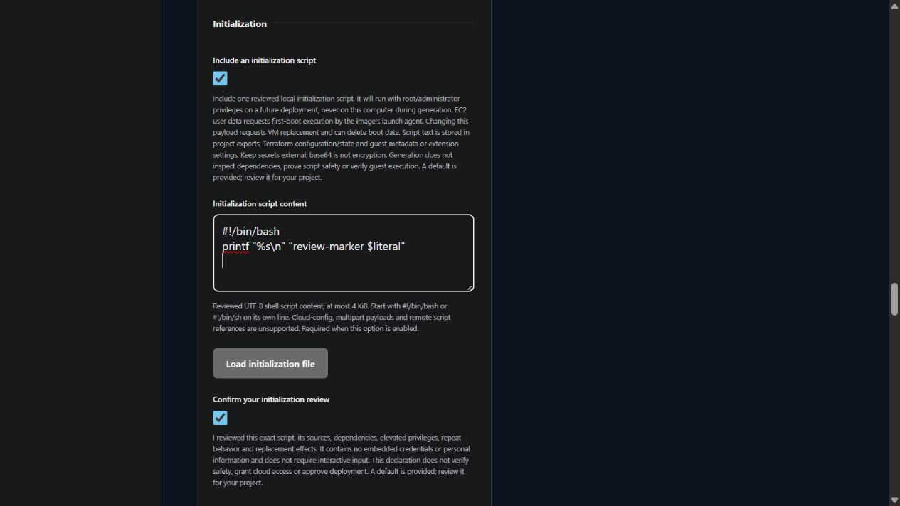

# VM initialization scripts

Status: v0.4.0 development. Guest execution has not been tested in cloud accounts.

Standalone Linux and Windows VM questionnaires can include one reviewed local script. Enable **Include an initialization script**, paste the content or select **Load initialization file**, then confirm your review. The terminal questionnaire reads a local file path. Generation copies content into the project; it never executes that script on this computer.

| Input | Requirement |
| --- | --- |
| Script content | UTF-8, at most 4 KiB measured in bytes; no private-key blocks, invalid text or unsupported control characters |
| Linux format | #!/bin/bash or #!/bin/sh on its own first line |
| Windows format | Raw PowerShell without EC2 XML wrappers or persistence tags |
| Review declaration | Required for enabled initialization; changing script content in the browser clears the previous declaration |
| Disabled initialization | Clear script content and the review declaration |

The shared size limit keeps the Windows inline command bounded; it does not represent each cloud's maximum payload size. Remote script downloads, cloud-config and multipart formats are unsupported. Scripts must be noninteractive. Review all commands, dependency sources, guest-agent requirements and compatibility yourself. This declaration records your review; it does not prove safety or approve deployment.

## Execution mechanisms

| Provider | Linux | Windows | Change and repeat behavior |
| --- | --- | --- | --- |
| AWS | EC2 shell user data | EC2 launch-agent PowerShell user data | First-boot behavior depends on the image/agent. Generated Windows wrappers omit persistence. Payload changes request VM replacement. |
| Azure | Cloud-init custom data | Custom Script Extension, using an inline command in protected settings | Linux custom-data changes replace the VM. Windows extension changes can rerun the script. Extension execution uses LocalSystem. |
| GCP | Guest-environment startup metadata | Guest-environment PowerShell startup metadata | Startup scripts can run again on boots. Make every operation safe to repeat. |

Guest execution uses root or administrator privileges. No script execution, completion, application installation, reboot, login or cleanup has been verified live. VM readiness does not establish that initialization succeeded. User-supplied scripts can make network calls or modify guest security settings on a future deployment; review those effects before using Terraform.

AWS and Azure Linux payload changes can replace the VM and delete boot-disk data. Deletion protection can also block that replacement. Review the plan, backups and recovery before changing content. An optional attached data disk is not automatically formatted or mounted.

## Content handling

The exact script is saved in project exports and generated variable defaults. It can reach Terraform state, saved plans, cloud metadata and extension settings. Base64 is encoding, not encryption. Azure protected settings protect extension transport but do not remove Terraform state exposure. Keep passwords, tokens, private keys and personal information out of scripts and exports. Private-key pattern rejection is not comprehensive secret detection.

File selection reads only the selected bounded regular file. No remote URL is fetched. Oversized or invalid UTF-8 browser uploads preserve current content. Remembered browser choices store recipe selection and wizard position, not script content. Explicit project exports do contain the script; handle them accordingly. Human-readable choice summaries omit its text.

Development plan-review policy 0.12.0 flags initialization content/references, unresolved payloads, removal of prior initialization and Azure guest extensions for manual review. Reports omit contents, retain incomplete policy coverage and never approve deployment. Review initialization and extension commands manually, even when other local checks pass. See [Plan review](PLAN_REVIEW.md) for exact scope.

## References

Provider behavior is documented in [AWS EC2 user data](https://docs.aws.amazon.com/AWSEC2/latest/UserGuide/user-data.html), [Azure custom data](https://learn.microsoft.com/en-us/azure/virtual-machines/custom-data), [Azure Windows Custom Script Extension](https://learn.microsoft.com/en-us/azure/virtual-machines/extensions/custom-script-windows), [Google Linux startup scripts](https://cloud.google.com/compute/docs/instances/startup-scripts/linux) and [Google Windows startup scripts](https://cloud.google.com/compute/docs/instances/startup-scripts/windows).
