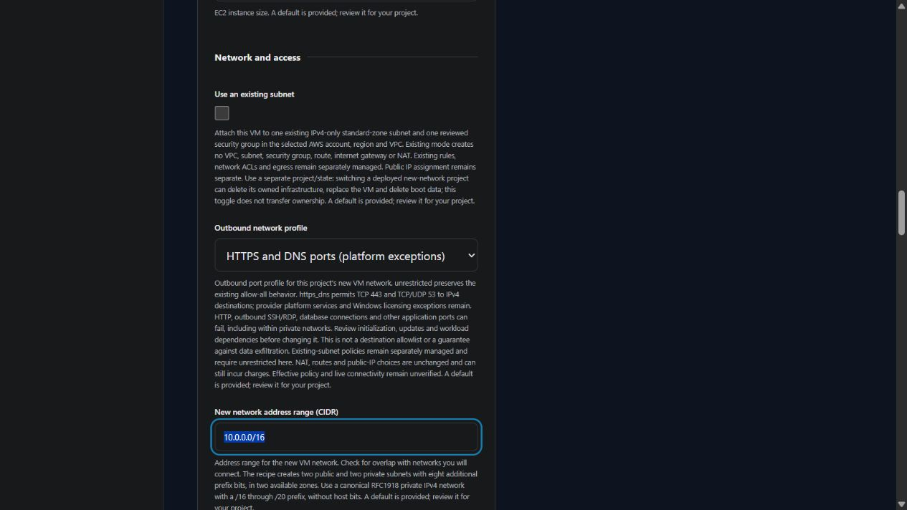
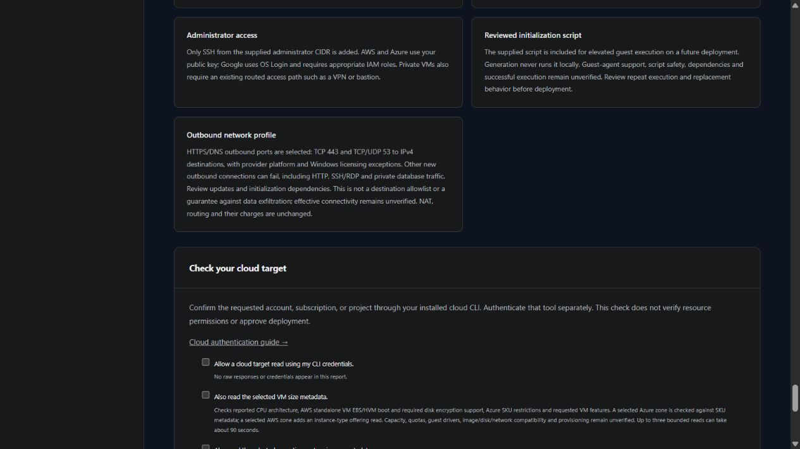

# VM outbound network profiles

Available on development main for standalone Linux and Windows VMs in AWS, Azure and GCP. The latest release remains v0.3.0; live connectivity has not been verified.

In **Network and access**, choose **Outbound network profile** before generating or exporting your configuration.

| Profile | Generated behavior | Choose when |
| --- | --- | --- |
| Unrestricted outbound ports | Preserves the previous outbound configuration | Workload dependencies require other ports, or you are retaining the current configuration |
| HTTPS and DNS ports | Allows TCP 443 and TCP/UDP 53, with provider platform and Windows licensing exceptions; denies other new outbound connections | You have reviewed updates, initialization and application dependencies against these ports |

HTTPS and DNS destinations are unrestricted IPv4 addresses. This is a port profile, not a destination allowlist or protection against data exfiltration. HTTPS and DNS can carry arbitrary application traffic. HTTP, outbound SSH/RDP, database ports and other application connections can fail, including between private machines. Linux package repositories, Windows updates and initialization scripts can require additional endpoints or ports. Review dependencies before selecting the restricted profile.

## Provider behavior

| Provider | Scope and restricted rules | Platform exceptions |
| --- | --- | --- |
| AWS | The project's VM security group permits TCP 443 and TCP/UDP 53; other outbound ports receive no allow rule | Security groups do not filter certain platform traffic, including Amazon DNS, metadata, DHCP, time synchronization and Windows license activation |
| Azure | The project's new workload-subnet NSG permits HTTPS/DNS, then denies other outbound traffic at priority 2010 | Windows adds TCP 1688 to the AzurePlatformLKM service tag. Azure host platform traffic has separate filtering rules |
| GCP | The project's new network applies HTTPS/DNS allows at priority 1000 and an outbound deny at 1100 to its VM target tag | Windows preserves the existing activation endpoint rule. Metadata/platform traffic has provider-specific exceptions |

These controls are stateful: permitted inbound connections can receive replies. Existing connections and inherited or higher-priority cloud policies can affect effective behavior. Generation does not inspect those policies or establish deployment readiness. See the primary [AWS security-group guidance](https://docs.aws.amazon.com/vpc/latest/userguide/vpc-security-groups.html), [Azure NSG guidance](https://learn.microsoft.com/en-us/azure/virtual-network/network-security-groups-overview) and [Google Cloud firewall guidance](https://docs.cloud.google.com/firewall/docs/firewalls).

## Existing networks and changes

The profile is shown only for new standalone VM networks. Existing-subnet attachment creates no outbound policy; its rules remain separately managed. In that mode the input must be absent or `unrestricted`. This value means the generator adds no restriction; it does not describe the existing network's actual policy. Imported/API projects with an inactive restricted profile are rejected.

Changing the profile does not change public-IP, routing or NAT choices. NAT and other infrastructure can still incur charges. Private VMs still need a suitable routed access path. This implementation supports IPv4 only and offers no custom destination or arbitrary-port editor.

Review the Terraform plan before changing deployed rules. Switching from a deployed new network to existing-network attachment can destroy owned resources and replace the VM; use separate project/state and ownership review. The profile does not transfer infrastructure ownership.

## Verification

The generated resource guide and CLI output summarize the selected profile and its limits. Existing-network guidance describes separately managed policy rather than claiming unrestricted effective access.

Both profiles pass native Terraform validation and TFLint across 24 provider/OS/public-private configurations. Provider-mocked plans check restricted ports, ordered denies, Windows exceptions and unchanged unrestricted defaults. Existing-network mocked plans verify that no new outbound firewall is managed. These are local, synthetic checks; creation, effective policy, updates, activation, access and cleanup remain pending [dedicated-account acceptance testing](VM_ACCEPTANCE.md).
