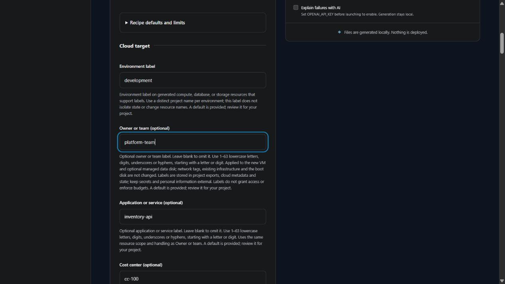

# Label VM resources

v0.4.0 development adds optional owner, application and cost-center questions for standalone Linux and Windows VMs on AWS, Azure and Google Cloud. The latest release remains v0.3.0; effective cloud labels and billing behavior remain unverified.

Enter these values under **Cloud target**, or leave them blank to omit the labels.

| Question | Cloud key | Example |
| --- | --- | --- |
| Owner or team | `owner` | `platform-team` |
| Application or service | `application` | `inventory-api` |
| Cost center | `cost_center` | `cc-100` |

Use 1–63 lowercase letters, digits, underscores or hyphens, starting with a letter or digit. The same portable format applies on all three clouds. The existing environment and management labels remain separate and cannot be replaced through these fields.

## Where labels apply

| Cloud | Scope |
| --- | --- |
| AWS | Provider default tags on newly managed resources that support tags |
| Azure | The new resource group and generated resources that support tags; tags are assigned explicitly |
| Google Cloud | The new VM and optional managed data disk; boot disks and network resources are excluded |

Existing subnets, security groups, identities and other independently managed resources are not retagged. GCP labels do not change firewall network tags. Web tiers, databases and static sites retain their existing fixed label behavior; these additional questions are currently scoped to standalone VMs.

Labels are stored in project exports, cloud metadata and Terraform state. Keep secrets and personal information external. These fields help identify resources; they do not grant access, isolate environments, activate billing allocation or enforce budgets. Review any account-specific tag policy and cost reporting setup independently.

CLI collection, browser import/export and generated variable defaults use the same input contract. Blank labels are omitted from the generated map; invalid values fail with field-level feedback. See the [VM input inventory](VM_INPUTS.md) and [roadmap](ROADMAP.md) for remaining operational choices.
