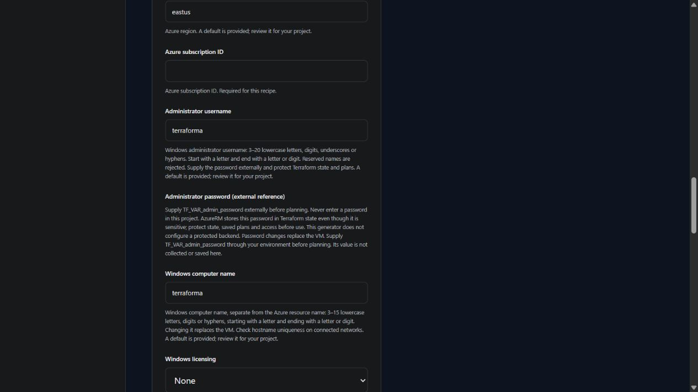

# Windows virtual machines

v0.4.0 development adds optional [existing GCP subnet attachment](GCP_EXISTING_SUBNET.md). Existing network access, egress and Windows activation connectivity remain separately managed and unverified.

v0.4.0 development adds guided [existing custom-image inputs](CUSTOM_IMAGES.md). This optional path requires an image compatibility declaration; image trust, provisioning agents, password recovery and access remain unverified.

AWS and GCP standalone VMs offer [boot-disk deletion or retention](BOOT_DISK_LIFECYCLE.md). The existing deletion default is preserved. Retention requires separate recovery, key preservation and cleanup; live lifecycle behavior remains unverified.

GCP standalone VMs offer a direct administrator network or [Google IAP tunnel](GCP_IAP_ACCESS.md). IAP generation targets RDP port 3389; tunnel IAM and Windows guest credentials are configured separately. Live connectivity remains unverified.

GCP boot and optional data disks can reference one [existing Cloud KMS key](GCP_DISK_KEYS.md). Google-managed encryption remains the default; key location, service-agent access and recovery are reviewed separately. No key or IAM grant is created.

v0.3.0 includes initial **AWS, Azure and Google Cloud Windows Server 2022** recipes in the local workspace and terminal wizard. This is Terraform generation with structural verification; cloud creation, password recovery, RDP access and teardown have not been tested.

## Azure

v0.4.0 development supports optional [existing user-assigned workload identity](AZURE_WORKLOAD_IDENTITY.md) attachment. System-assigned remains the default when enabled; no role assignments are created and live access remains unverified.

Development generation now uses the refreshed `windowsserver2022` offer. [Microsoft's migration announcement](https://techcommunity.microsoft.com/blog/azurecompute/incoming-changes-for-window-server-2022-marketplace-image-users/4262423) identifies the legacy `windowsserver` offer's Windows Server 2022 SKUs as deprecated from June 2026; the refreshed offer excludes .NET 6. Regenerating an older project changes its image reference and can replace the VM and delete boot data. Confirm the selected version exists under the new offer, review application dependencies and backups, then review the Terraform plan. Existing exact pins are not automatically translated. Generation does not migrate an existing guest or prove regional image availability.

| Choice | Supported behavior |
| --- | --- |
| Image | MicrosoftWindowsServer / windowsserver2022, desktop 2022-datacenter-g2 (default) or Core 2022-datacenter-core-g2, with latest or an exact marketplace version for the selected SKU |
| Capacity | Standard_D2s_v5 default; configurable size, 128 GiB boot disk default/minimum, optional empty data disk |
| Disk caching | None, ReadOnly or ReadWrite; boot defaults to ReadWrite and data defaults to None. Review durability and VM/disk support before changing cache modes |
| Guest naming | Separate 3–15 character computer name and 3–20 character administrator username; reserved usernames rejected |
| Placement | Regional default or zone 1–3, shared by VM, optional data disk, Standard NAT gateway and generated public IPs; changes replace resources |
| Administration | Restricted RDP on TCP 3389; optional public VM address or an existing private routed access path |
| Password | External `TF_VAR_admin_password` reference, sensitive variable without a default; no password entry, retrieval or output |
| Licensing | Standard licensing (`None`) by default; `Windows_Server` requires independently verified Azure Hybrid Benefit eligibility |
| Protection | Secure Boot enabled by default and configurable, vTPM enabled; optional diagnostics, accelerated networking and managed identity |
| Guest updates | Windows automatic updates and VM agent enabled with `AutomaticByOS`; patch completion is not verified |
| Patch assessment | Optional automatic platform assessment; default keeps image assessment behavior. Installation mode stays AutomaticByOS and assessment success is unverified |

**Protect Terraform state and saved plans before using the Azure recipe.** AzureRM retains the administrator password in those artifacts even when it comes from an environment variable and is marked sensitive. The exported project stores only the environment-variable reference; it does not configure a protected backend. Password changes replace the VM. See the [credential and state boundary](AZURE_WINDOWS_DESIGN.md).

The generated Terraform validates a 12–123 character password with at least three character categories when Terraform receives it; TerraForma never reads that value. Azure and guest policy can impose additional restrictions. Microsoft documents [Windows VM password requirements](https://learn.microsoft.com/en-us/azure/virtual-machines/windows/faq) and the [supported Windows marketplace images](https://learn.microsoft.com/en-us/azure/virtual-machines/automatic-vm-guest-patching). Availability, eligibility and successful provisioning still need account-specific verification.

The computer name is an explicit input, independent of the longer project/resource name. Changing it replaces the VM. AzureRM also replaces the VM when Secure Boot changes; the OS disk can be deleted. Review the plan, backups and BitLocker recovery keys before changing it. This recipe does not enable or escrow BitLocker, join a domain, configure backups or verify recovery. NAT provides outbound access and can incur charges; its public address does not make a private VM reachable through RDP.

## AWS

| Choice | Supported behavior |
| --- | --- |
| Image | Amazon-published Windows Server 2022 English Full Base (default) or Core Base, x86_64/HVM |
| Image version | Latest matching image at planning time, or a matching AMI ID in the selected region |
| VM size | Configurable; defaults to `t3.small`. Memory, availability, licensing and price require review |
| Placement | Optional standard AWS zone name; blank uses automatic placement. Two standard zones are required; changes can replace subnets, the VM and disks |
| Boot disk | 50 GiB default, 30–2,048 GiB; gp3 or gp2 |
| gp3 performance | Same guided IOPS/throughput limits and ratio checks as the Linux recipe |
| Data disk | One optional new empty disk; initialization, formatting, backup and retention stay separate |
| Network | New configurable private IPv4 network; public/private access and optional fixed private address |
| Administrator access | RDP on TCP 3389 from a private administrator subnet or one public IPv4 /32 address |
| Credentials | Existing RSA public key only; password recovery happens separately in EC2 |
| Workload identity | Optional existing IAM instance profile; policies and pass-role permission require review |
| Protection | EC2 termination protection enabled by default; IMDSv2 required; optional explicit one/two-hop token response limit, with unmanaged provider default preserved |
| Outputs | Instance ID, Name tag, availability zone, address, `Administrator` username and optional disk ID |

### AWS access after provisioning

Keep the RSA private key outside the project. The public key must match it and use a structurally valid OpenSSH RSA encoding with at least a 2,048-bit modulus. Ed25519 is rejected for this recipe because [EC2 Windows instances support RSA key pairs](https://docs.aws.amazon.com/AWSEC2/latest/UserGuide/create-key-pairs.html).

After a separately reviewed deployment, use the EC2 console's password recovery workflow or the [AWS CLI `get-password-data` command](https://docs.aws.amazon.com/cli/latest/reference/ec2/get-password-data.html), with the instance ID, region and matching private-key file. EC2 can take up to 15 minutes to make the initial encrypted password available. Do not copy the recovered password or private key into a TerraForma manifest, browser form, AI diagnostics or Git repository.

TerraForma does not retrieve or decrypt password data, generate a private key, or place either credential in its generated Terraform inputs or outputs. Terraform state still contains infrastructure information and requires protected storage. The initial password is not a password rotation or recovery policy.

Private VMs require an existing routed access path such as a VPN or bastion; this recipe creates neither. A public address alone does not satisfy the restricted administrator rule. Application installation, domain joining, custom images, Windows patching, certificate configuration, backup and automatic disk initialization remain outside this recipe.

The image query retains the Amazon owner, selected Windows Server 2022 Full/Core Base name, x86_64 and HVM filters even when an AMI ID is pinned. Image pins do not install security updates and image changes can replace the VM. The selected base image does not add a configurable Secure Boot or TPM guarantee. Verify account policy, image availability, guest compatibility and costs before planning.

Choose **Windows Server 2022 Core Base** for the initial AWS Core recipe. Core omits the standard desktop and needs compatible applications and administration tools. [Microsoft explains the installation differences](https://learn.microsoft.com/en-us/windows-server/get-started/getting-started-with-server-with-desktop-experience), including the lack of in-place conversion between Core and Desktop Experience. Switching the image replaces the VM; review backups, disk retention and encryption-key lifecycle first. The query uses the English Core Base naming pattern documented in [AWS Windows AMI history](https://docs.aws.amazon.com/ec2/latest/windows-ami-reference/ec2-windows-ami-version-history.html). This option does not add TPM/STIG/container images or verify that a matching image is currently available in your region. Azure retains its existing Windows installation choice.

AWS publishes [Windows AMI version history](https://docs.aws.amazon.com/ec2/latest/windows-ami-reference/ec2-windows-ami-version-history.html), including the 30 GiB root volume used by Core and Full Base images. A larger disk does not replace guest filesystem verification or backups.

## Google Cloud

The standard Windows VM exposes host maintenance (`MIGRATE` or `TERMINATE`) and automatic restart after Compute Engine host failures or maintenance. Defaults are migration and enabled restart. These are host lifecycle settings, not Windows patch schedules, application recovery or a promise of uninterrupted access. See [host maintenance and restart](LINUX_VM.md#gcp-host-maintenance-and-restart) for prerequisites and limits.

| Choice | Supported behavior |
| --- | --- |
| Image | Latest `windows-cloud/windows-2022` or `windows-2022-core` family, or a matching supported exact Datacenter image name from `windows-cloud`; x86_64 |
| VM size | Configurable, default `e2-standard-2`; availability, licensing and price require review |
| Boot disk | 64 GiB default/minimum through 2,048 GiB; pd-balanced, pd-standard or pd-ssd |
| Data disk | One optional new empty persistent disk; no initialization, backup or retention policy |
| Network | New regional private subnet; optional public IP and fixed private address |
| Administrator access | Restricted RDP on TCP 3389 through the selected direct network or IAP tunnel; no SSH key or Linux OS Login configuration |
| Credentials | Requested local username, default `terraforma`; separate Google credential setup after provisioning |
| Activation | Private Google Access, an Internet-gateway route to `35.190.247.13/32`, and tagged TCP 1688 egress |
| Boot integrity | Secure Boot enabled by default and configurable; vTPM/integrity monitoring remain enabled |
| Protection | Deletion protection enabled by default; automatic stopping for updates disabled |

Enter `latest` or a published image name beginning `windows-server-2022-dc-v` for desktop images or `windows-server-2022-dc-core-v` for Core, followed by an 8–10 digit version suffix. The selected installation option and exact pin must match. Custom publisher projects and other Windows versions are outside this initial input. Select the exact name from the official `windows-cloud` image catalog; TerraForma checks its supported shape, not its existence, license or boot compatibility. Google's [Windows VM guide](https://docs.cloud.google.com/compute/docs/instances/windows/creating-managing-windows-instances) explains image selection. Pinning does not install patches, and changing an image can replace the VM and delete boot data. Review backups and the Terraform plan first.

Choose **Windows Server 2022 Core** for Google's published `windows-2022-core` family, documented in [supported operating systems](https://docs.cloud.google.com/compute/docs/images/os-details). Core omits the standard desktop; verify application and administration-tool compatibility. The existing private/public network choices, IAP option, external guest credential workflow, activation routing and Shielded VM controls are preserved. Live boot, activation and access remain unverified.
| Workload identity | Optional existing user-managed service account; IAM permissions require separate review |
| Outputs | VM path/name/zone/address, requested username and optional disk ID |

The username output records the account you intend to configure; Terraform does not create that local account. After provisioning and guest initialization, use [Google's Windows credential workflow](https://docs.cloud.google.com/compute/docs/instances/windows/generating-credentials) through the console or `gcloud compute reset-windows-password`, with the VM name, project, zone and requested username. This operation creates a user or resets an existing password. Resetting an existing user can lose data encrypted with the old password. TerraForma does not run this operation, retrieve a password or request a private key. Guest-agent readiness, IAM permissions and actual login remain unverified.

[Windows activation requires a direct Internet-gateway route](https://docs.cloud.google.com/compute/docs/instances/windows/creating-managing-windows-instances#kms-server), with Private Google Access for VMs that have only an internal address. Cloud NAT is used for other outbound traffic and is not the activation path. The explicit activation rule does not override organization or hierarchical firewall policy. This IPv4 recipe does not configure IPv6 activation, domain joining or private routed administrator access.

Before changing Shielded VM settings, confirm that BitLocker recovery keys are accessible or suspend BitLocker in the guest. [Google documents the recovery risk](https://docs.cloud.google.com/compute/shielded-vm/docs/modifying-shielded-vm): changes to the boot integrity baseline can require a recovery key. TerraForma does not enable BitLocker, escrow keys, stop the VM or verify its boot/activation state.

The guest-agent password workflow changes VM metadata outside Terraform. Review any resulting metadata differences in subsequent plans. Passwords and private keys must stay outside browser preferences, manifests, Git and AI diagnostics; infrastructure state still needs protected storage. Neither generation nor local validation proves the deployment or account credential setup will succeed.

## AWS CPU credit choices

AWS standalone Windows VMs expose the same [CPU credit modes](LINUX_VM.md#aws-cpu-credit-mode) as Linux VMs. Review sustained CPU needs and surplus-credit charges before choosing standard or unlimited. Provider-default mode leaves the setting unmanaged and does not reset an existing VM.
